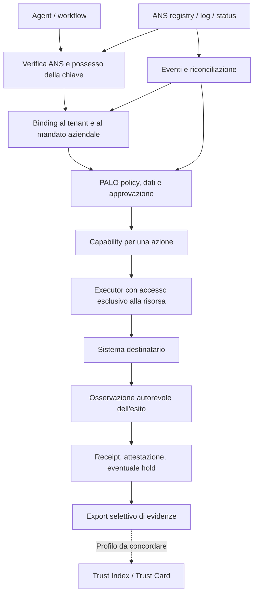

# PALO x GoDaddy Agent Name Service

Nota di archivio: questo documento descrive lo snapshot precedente al commit di integrazione. Percorsi locali e punteggiatura sono stati adattati per il repository; i report originari restano archiviati localmente. Nessun aggiornamento del sito è implicato da questa copia.
Analisi strategica, tecnica e dei gap  -  16 settembre 2026.

**Aggiornamento operativo:** dopo questa valutazione sulla base pubblica è stata implementata e verificata una prima integrazione SDK con demo offline. Il [resoconto dell'implementazione](stato-integrazione.md) distingue i gap chiusi nel prototipo da quelli ancora aperti e contiene i risultati dei test. Le tabelle di maturità qui sotto descrivono la base analizzata, non una promozione in produzione.

**Valutazione:** PALO può usare ANS come fonte verificabile di identità esterna e contribuire all'ecosistema con decisioni contestuali, evidenze di controllo ed esiti osservati. La priorità consigliata è un adattatore verificabile e una dimostrazione riproducibile del ciclo identità -> autorità -> dati -> azione -> risultato. Un registro concorrente o un nuovo punteggio universale di fiducia avrebbero oggi un rapporto costo/beneficio meno favorevole.

**Limite essenziale:** ANS comprende già specifiche per trust, attestazioni e reputazione. Non sarebbe corretto presentare PALO come il primo strato di governance di un ecosistema che ne è completamente privo. La differenziazione proposta riguarda il legame verificabile fra singolo caso d'uso, mandato, dati, decisione ed effetto.

## 1. Metodo e attendibilità

Ho confrontato fonti primarie GoDaddy, Linux Foundation e IETF, specifiche e implementazioni pubbliche ANS, documentazione PALO e parti del runtime. La pagina italiana iniziale non era recuperabile; la pagina globale è stata letta tramite il reindirizzamento regionale restituito dal sito. Alcuni file del workspace locale non erano leggibili per errori di disponibilità/autenticazione del filesystem: per quei materiali ho usato la copia pubblica PALO, senza presumere che eventuali modifiche locali coincidano con essa.

Snapshot di riferimento:

- PALO: `a9b258d01b3c169c142f44b4c6fc175cecb681f6`, commit del 14 settembre 2026.
- Specifiche ANS: `a6dcb0789b3710c4b367fd53b7f91c5adf120965`, commit del 14 settembre 2026.
- Agent Trust Discovery: `94b687b0b9907c083de9e86fc4a0874f4e5b0535`, commit del 4 settembre 2026.

Le capacità descritte nelle specifiche non sono automaticamente funzionalità disponibili nell'API GoDaddy ospitata. Non ho eseguito registrazioni, modifiche DNS, acquisti, chiamate autenticate o un collaudo del servizio ANS. Le stime di effort e di impatto sono valutazioni progettuali, non benchmark o preventivi. Non sono disponibili evidenze sufficienti per quantificare traffico, conversioni, ricavi o riduzione degli incidenti.

## 2. Che cosa è ANS oggi

ANS collega identità di agenti a domini, versioni, endpoint e prove crittografiche. GoDaddy ne offre un'implementazione con discovery e API di registrazione. DNS, certificati e transparency log permettono verifiche riutilizzabili fra protocolli. [GoDaddy Agent Identity](https://www.godaddy.com/ans).

Il 15 settembre 2026 GoDaddy ha descritto la composizione di ricevuta SCITT, status token, prova di possesso tramite mTLS/DPoP e OAuth. Lo status token ha un TTL predefinito dichiarato di un'ora: la verifica offline comporta quindi una finestra di freschezza. Le prestazioni sub-millisecondo pubblicate riguardano il benchmark del fornitore, non il costo end-to-end di una chiamata governata da PALO. [Descrizione tecnica GoDaddy](https://www.godaddy.com/resources/news/dont-trust-verify-offline-sub-millisecond-agent-verification-with-ans).

Vanno distinti quattro oggetti:

| Oggetto | Funzione | Implicazione per PALO |
|---|---|---|
| Protocollo ANS e specifiche ANS-0...5 | Identità, registrazione, naming, DNS, trasparenza, monitoraggio | Implementare un profilo preciso, versionato e testato |
| Servizio GoDaddy | Implementazione ospitata e discovery | Verificare contratto API, accesso, limiti, gestione delle chiavi e SLA |
| Trust Index | Valutazione di integrità, identità, solvibilità, comportamento e sicurezza | Consumare o fornire evidenze; evitare un punteggio PALO ridondante |
| Implementazioni open source | Codice e riferimenti per interoperabilità | Utili per test; maturità distinta dal servizio commerciale |

Il Trust Index contempla già attestazioni esterne e segnali comportamentali. La specifica lascia aperte scelte di pesatura e integrazione delle osservazioni: questo è uno spazio concreto di contributo per PALO. L'implementazione Agent Trust Discovery dichiara esplicitamente finalità di riferimento e segnali semplificati, non prontezza produttiva. [Trust Index](https://github.com/agentnameservice/ans-registry/blob/a6dcb0789b3710c4b367fd53b7f91c5adf120965/TRUST_INDEX_SPEC.md), [implementazione](https://github.com/agentnameservice/agent-trust-discovery/blob/94b687b0b9907c083de9e86fc4a0874f4e5b0535/README.md).

**Standardizzazione:** il documento ANS v2 consultato è un Internet-Draft individuale, non un RFC approvato. Linux Foundation ha annunciato il 23 giugno 2026 l'intenzione di avviare ANS; anche il post GoDaddy del 15 settembre parla di intenzione di conferire i repository. La comunicazione della landing è più assertiva. Occorre verificare lo stato formale di governance prima di usare formule come "standard IETF approvato" o "conformità Linux Foundation". [IETF](https://datatracker.ietf.org/doc/draft-narajala-courtney-ansv2/), [Linux Foundation](https://www.linuxfoundation.org/press/linux-foundation-announces-intent-to-launch-agent-name-service-to-establish-trusted-identity-infrastructure-for-ai-agents).

## 3. Dove si colloca PALO

| Livello | Risposta utile | Base PALO riscontrata | Limite attuale |
|---|---|---|---|
| PALO Framework | Perché utilizzare questo sistema, con quali responsabilità e controlli? | Casi, gate, controlli, evidenze, indicatori | La compilazione non dimostra l'efficacia operativa |
| PALO-AM | Quale autonomia e delega sono accettabili? | Modello di governo degli agenti | Il modello richiede applicazione nel runtime |
| PALO-AI | Questa azione è autorizzata qui, ora, su questi dati? | Action Claim, policy, approvazione, capability | Developer preview; confine produttivo incompleto |
| PALO Data Assurance | I dati sono idonei allo scopo e la divulgazione rispetta il contratto? | Fitness Decision, Disclosure Contract/Receipt | Attendibilità e isolamento dei connettori da qualificare |
| PALO Outcome Assurance | L'effetto osservato corrisponde al risultato autorizzato? | Effect Contract, attestazione, incidente e hold | Serve un osservatore autorevole; non copre ogni effetto possibile |
| PALO Knowledge Reader | Come consultare la conoscenza canonica PALO? | Servizio informativo separato con sei strumenti | Production candidate con gate residui; non agente operativo autonomo |

Fonti: [matrice delle capacità](https://github.com/sev7enITA/PALOframework/blob/a9b258d01b3c169c142f44b4c6fc175cecb681f6/agentic/capability-matrix.json), [ciclo operativo](https://github.com/sev7enITA/PALOframework/blob/a9b258d01b3c169c142f44b4c6fc175cecb681f6/docs/palo-ai-full-cycle-assurance.md), [Data Assurance](https://github.com/sev7enITA/PALOframework/blob/a9b258d01b3c169c142f44b4c6fc175cecb681f6/docs/palo-data-assurance-control-plane.md), [Reader](https://github.com/sev7enITA/PALOframework/blob/a9b258d01b3c169c142f44b4c6fc175cecb681f6/docs/palo-knowledge-reader-production.md).

Il registro pubblico risponde all'identità e alla reperibilità. Il registro PALO deve mantenere l'inventario aziendale: owner, tenant, caso d'uso, dati, strumenti, policy e deployment. Sincronizzarli è utile; sostituire l'uno con l'altro perde informazione.

## 4. Matrice degli scenari

"Condotto" è interpretato come canale tecnico/operativo, componenti e processo coinvolti. Impatto A/M/B = alto/medio/basso potenziale rispetto alla strategia PALO; effort S/M/L/XL = crescente, relativo, non calendario. P1 = sperimentare prima; P2 = dopo il nucleo; P3 = opportunità condizionata; NO = sconsigliato ora.

### Interfacciarsi e integrare

| # | Scenario e condotto/componenti | Beneficio e impatto | Malus/rischio | Gap e priorità |
|---|---|---|---|---|
| 1 | Registrare un endpoint informativo PALO: Reader -> API/DNS ANS | Reperibilità, caso d'uso pubblico; M | Visibilità senza domanda; endpoint protetto scambiato per accesso pubblico | Verificare ammissibilità MCP, metadata e gate Reader; S/M, P1 |
| 2 | Importare ANS nell'inventario: resolver -> AI System & Agent Registry | Riduce duplicazioni e agenti senza owner; A | Record importato scambiato per approvazione | Mapping esterno, stato, provenienza, riconciliazione; M, P1 |
| 3 | Verificare identità in ingresso: edge/SDK -> authority verifier PALO | Riduce impersonazione e riuso di prove altrui; A | Nuova dipendenza da trust root e verifica | Binding richiesta/chiave/tenant/delega; M/L, P1 |
| 4 | Verificare la controparte prima dell'egress: connector -> ANS | Controlla il destinatario prima di inviare dati; A | Identità valida ma destinatario non autorizzato | Policy destinatari, redirect, chiavi, endpoint e disclosure; L, P1 |
| 5 | Admission di workflow: n8n/MCP/A2A -> registry + gate | Ferma dipendenze non approvate prima dell'uso; A | Un controllo iniziale diventa obsoleto | Riconvalida a esecuzione, rimozione accessi diretti; L, P1 |
| 6 | Revoca e drift: feed/poll ANS -> invalidazione PALO | Blocca nuovi utilizzi di identità compromesse; A | Falsi stop, eventi persi, esecuzioni già avviate | Grafo dipendenze, cursori durabili, freshness e hold; L, P1 |
| 7 | Delega fra organizzazioni: identità ANS -> Authority Context | Chiarisce mittente, destinatario e mandato; A | Fiducia transitiva e ampliamento privilegi | Catena firmata, attenuazione scope, audience, budget; XL, P2 |
| 8 | Registro aziendale privato/federato | Identità riusabile per agenti interni; M/A | Nuovo servizio critico da operare | PKI, DNS privato, trust root, HA, recovery; XL, P3 |

### Complementare e fornire evidenze

| # | Scenario e condotto/componenti | Beneficio e impatto | Malus/rischio | Gap e priorità |
|---|---|---|---|---|
| 9 | Dossier di governance collegato alla Trust Card | Porta contesto e responsabilità vicino all'agente; A | Esposizione di informazioni interne; badge ambiguo | Export minimo, scadenza, scope e issuer; M, P1 |
| 10 | Credenziali verificabili da Evidence Pack | Evidenze riusabili fra clienti; A | Autovalutazione presentata come audit | Formato interoperabile, custodia chiavi, revoca; L, P2 |
| 11 | Outcome/incidenti come segnali del Trust Index | Evidenze operative contestuali per behavior/safety; A | Bias, cherry-picking e contestazioni | Denominatori, provenienza, privacy, campionamento; L, P2 |
| 12 | Evidence envelope PALO ancorato a transparency service | Rende rilevabili modifiche successive; M/A | Costo, metadati pubblici, falsa prova di verità | Servizio compatibile: non assumere che ANS accetti log arbitrari; L, P2 |
| 13 | Procurement e due diligence agenti | Unisce identità del fornitore e requisiti d'uso; A | Dossier obsoleto o sovraccarico documentale | Gate per rischio, review owner, evidenze esterne; M, P1 |
| 14 | Incident response coordinata | Collega identità, versioni, effetti e risorse colpite; A | Confondere blocco locale con revoca globale | Runbook, deleghe operative, retention, escalation; L, P1 |
| 15 | Governance del cambiamento | Riesamina modello/prompt/tool/dati anche con ANSName invariato; A | Alert fatigue e troppe riapprovazioni | Manifesto deployment e regole di materialità; M/L, P1 |
| 16 | Osservatorio delle evidenze ANS | Misura adozione, drift e qualità dei metadati; M | Rating pubblici poco fondati; scraping costoso | Dati consentiti, metodologia, rettifica; M/L, P3 |

### Supportare l'iniziativa e sviluppare canali

| # | Scenario e condotto/componenti | Beneficio e impatto | Malus/rischio | Gap e priorità |
|---|---|---|---|---|
| 17 | Contributo a specifiche: binding delle evidenze e revoche | Influenza interoperabilità; A | Manutenzione e confronto con proposte concorrenti | Profilo piccolo, casi e vettori di test; M, P1 |
| 18 | Harness di conformità/adversarial testing | Dimostra problemi e integrazioni riproducibili; A | Test superati scambiati per certificazione | Profilo dichiarato, controlli negativi, revisione esterna; M/L, P1 |
| 19 | Pilota con GoDaddy o piattaforma di agenti | Distribuzione e feedback reale; A potenziale | Dipendenza commerciale e roadmap imposta | Design partner, obiettivo misurabile, supporto; L, P2 |
| 20 | Offerta enterprise di adozione e controllo | Monetizzazione su onboarding, operazioni ed evidenze; A potenziale | Costo di supporto e responsabilità | Primo cliente, supportabilità, pricing sperimentale; L/XL, P2 |
| 21 | Pacchetti verticali PA/HR/finanza/sanità | Rende i controlli specifici e comprensibili; A | Molte eccezioni, dati sensibili, validazione lunga | Esperti di dominio e deployment qualificato; XL, P3 |
| 22 | Collegamento MCP Registry/A2A e altri discovery | Maggiore portabilità e minore dipendenza da ANS | Più mapping e contratti da mantenere | Identità canonica interna e adapter separati; M/L, P2 |
| 23 | RA/TL PALO pubblico concorrente | Autonomia infrastrutturale; B ora | PKI, reputazione, uptime e incidenti distolgono dal prodotto | Capacità operativa e adozione non dimostrate; XL, NO |
| 24 | Trust Index PALO completo | Controllo della metodologia; M potenziale | Duplica lavoro ANS; richiede solvibilità e reputation governance | Fonti non possedute, taratura, appelli, liability; XL, NO ora |

Nessuno scenario di partnership implica endorsement già ottenuto. Gli scenari 1 e 9 non trasformano automaticamente il Reader o il Framework in un agente autonomo. La discovery MCP dispone già di proprie modalità di autenticazione del publisher; ANS non è una condizione necessaria per pubblicare nel MCP Registry. [Documentazione MCP](https://modelcontextprotocol.io/registry/authentication).

## 5. Architettura raccomandata

**Flusso proposto:**

1. Risolvere il riferimento esterno, conservando versione, autorità di registrazione, stato e provenienza.
2. Validare prove e freschezza contro trust root configurate dall'organizzazione, non scelte dal chiamante.
3. Verificare il possesso della chiave sulla connessione/richiesta effettiva. Una copia della ricevuta non basta.
4. Associare l'identità verificata al principal aziendale, al tenant e all'istanza autorizzata. Il nome di dominio non concede ruoli interni.
5. Valutare mandato, scope, destinatario, dati, policy corrente, effetto atteso ed eventuale approvazione.
6. Generare una capability breve, non riutilizzabile e vincolata ai digest del contesto verificato.
7. Riconvalidare lo stato immediatamente prima dell'esecuzione secondo il rischio; consumare la capability atomicamente.
8. Eseguire attraverso il solo connettore ammesso e confrontare l'effetto con una fonte autorevole.
9. Conservare l'evidenza e gestire mismatch/incertezza; esportare solo quanto consentito.

La regola concettuale è una congiunzione di condizioni: identità valida **e** prova di possesso **e** mandato **e** policy **e** dati idonei **e** disclosure consentita **e** approvazione, quando richiesta. Un Trust Vector può aggiungere un requisito o una ragione di review; non deve scavalcare un divieto.

**Punto d'innesto concreto:** nel runtime esaminato `verifyCryptographicAuthority` richiama un `authorityVerifier` configurabile. È un punto candidato per comporre un verificatore ANS con la verifica aziendale del mandato. Non basta restituire `valid:true` dopo avere trovato un record ANS. [Codice PALO](https://github.com/sev7enITA/PALOframework/blob/a9b258d01b3c169c142f44b4c6fc175cecb681f6/packages/palo-mcp-server/core.js#L709).

## 6. Gap ANS: cosa copre e cosa resta da governare

Questi gap sono confini funzionali o rischi d'integrazione; non sono vulnerabilità dimostrate del servizio.

| Gap | Conseguenza | Contributo PALO | Residuo |
|---|---|---|---|
| Controllo di dominio vs mandato aziendale | Un operatore autenticato può chiedere azioni non autorizzate | Delega, owner, tenant e scope | Identità e deleghe vanno emesse/verificate da fonti affidabili |
| Versione dichiarata vs configurazione effettiva | Prompt, modello, tool o dati cambiano senza un nuovo nome | Digest del deployment e gate di change | Senza attestazione/isolamento la dichiarazione resta aggirabile |
| Registrazione vs singola azione | Un agente legittimo può fare un'operazione inappropriata | Policy contestuale e approvazione esatta | Policy errate producono decisioni errate |
| Metadati sigillati vs verità del contenuto | Una dichiarazione falsa può essere immutabile | Distinguere dichiarato, testato, osservato, verificato indipendentemente | L'attendibilità dell'issuer non nasce dalla firma |
| Reputazione generale vs idoneità allo scopo | Un rating favorevole non copre qualunque dato o processo | Valutazione per caso d'uso e rischio | Richiede dati di contesto completi |
| Stato remoto vs freschezza della decisione | Una revoca può arrivare dopo l'autorizzazione | TTL locale, eventi, riconciliazione e blocco | Le operazioni già eseguite non si annullano con la revoca |
| Identità vs prompt injection | Un agente autentico può essere indotto a esfiltrare dati | Limiti di azione, egress, destinatario e budget | Non costituisce una soluzione universale alla prompt injection |
| Trasparenza pubblica vs riservatezza | Nomi, relazioni o evidence link rivelano asset interni | Export selettivo e dossier privato | Un hash di dato prevedibile può essere correlabile |
| Standard aperto vs servizio federato reale | Migrazione e verificabilità potrebbero dipendere da implementazioni | Adapter neutrali e test fra autorità | Portabilità operativa da provare, non dedurre dal formato |
| Fiducia tecnica vs responsabilità | Certificati e score non identificano tutti gli owner di un danno | Registro responsabilità, decisioni e incidenti | Accordi contrattuali e review restano necessari |

ANS-5 distingue i riscontri dei monitor dalle decisioni della Registration Authority: il consumatore può applicare la propria policy di esclusione. Il blocco PALO deve essere dichiarato come decisione locale; non equivale alla revoca del certificato ANS. [ANS-5](https://github.com/agentnameservice/ans-registry/blob/a6dcb0789b3710c4b367fd53b7f91c5adf120965/spec/ans-5-integrity-monitoring.md).

## 7. Gap PALO: quali impediscono di superare la preview

| Priorità | Gap riscontrato | Perché ANS lo rende rilevante | Chiusura e criterio verificabile |
|---|---|---|---|
| P0 | Nessun bridge ANS qualificato nei componenti esaminati | L'identità esterna non è ancora una prova consumabile dal runtime | Adapter versionato; fixture positive/negative; prova di interoperabilità |
| P0 | Associazione identità esterna/ID interno/istanza | L'`agentId` PALO accetta `agent-...`, non un ANS URI | Record di binding firmato e tenant-bound; sostituzioni respinte |
| P0 | Prova di possesso dipendente dal verifier esterno | Ricevuta o digest copiati non dimostrano chi sta chiamando | Verifica mTLS/DPoP e legame al principal della richiesta |
| P0 | Revoca non propagata automaticamente nel grafo | Decisioni legate a un dataset possono dipendere dall'agente revocato | Calcolo delle dipendenze, invalidazione e test end-to-end |
| P0 | Connettori in-process aggirabili | L'agente può conservare un accesso diretto al target | Credenziali solo al connettore, rete vincolata, test di bypass |
| P0 | Chiavi nel processo applicativo | Un processo compromesso può produrre evidenze valide | Signer remoto KMS/HSM, separazione ruoli, rotazione e recovery |
| P0 | SQLite e runtime singola istanza | Eventi/revoche/esecuzioni richiedono consistenza anche nei guasti | Persistenza e durabilità adeguate al profilo di deployment, prova di recovery |
| P0 | Isolamento e amministrazione incompleti | Identità federata aumenta le superfici cross-tenant | Controlli storage, API, cache e job; test negativi di separazione |
| P0 | Assurance indipendente mancante | Autoverifica insufficiente per un confine di autorizzazione | Review di architettura/crypto, penetration test e retest indipendenti |
| P1 | Formati di evidenza differenti | JSON firmato PALO non equivale a VC o ricevuta COSE | Profilo di export, canonicalizzazione, trust root e revoca |
| P1 | Incident routing e replay distribuito incompleti | Un evento perso può lasciare autorizzazioni attive | Cursor durabile, deduplica, riconciliazione, escalation e runbook |
| P1 | Governance Hub ancora prototipale | Una UI dimostrativa non deve apparire come stato operativo | Dati autenticati, RBAC, provenienza, cronologia e audit |
| P1 | SLO e supportabilità da dimostrare | Un gate indisponibile blocca attività legittime | Obiettivi misurati, on-call, restore, rollback e budget di errore |
| P1 | Semantica dell'attestazione troppo facile da sovrainterpretare | "Verified" può essere letto come garanzia generale | Mostrare oggetto, verificatore, metodo, periodo e limiti |

La base pubblica dichiara già molti di questi limiti. Il controllo di admission che impedisce di avviare il profilo produttivo senza evidenze adeguate è una protezione corretta; rimuoverlo o rinominare la release non chiude i gap. [Piano di readiness](https://github.com/sev7enITA/PALOframework/blob/a9b258d01b3c169c142f44b4c6fc175cecb681f6/docs/palo-ai-production-readiness-plan.md), [piano di assurance](https://github.com/sev7enITA/PALOframework/blob/a9b258d01b3c169c142f44b4c6fc175cecb681f6/docs/palo-ai-security-assurance-and-scale.md).

### Tre gap di interfaccia verificati nel codice e negli schemi

**Identificatore:** il nome ANS non va inserito nel campo `agentId` esistente. Serve un binding esplicito e revisionabile. Inserirlo in `metadata` permette di trasportare informazione, ma non le attribuisce valore autorizzativo. [Action Claim](https://github.com/sev7enITA/PALOframework/blob/a9b258d01b3c169c142f44b4c6fc175cecb681f6/schemas/palo-agentic-action-claim.schema.json).

**Tipi di evento:** `palo-assurance-signal` non include eventi ANS dedicati di revoca identità o rotazione chiave. Una traduzione verso `access-changed`/`system-release` può essere sperimentata solo conservando il significato originale e definendone gli effetti; il profilo stabile richiede una decisione di schema versionata. [Schema segnali](https://github.com/sev7enITA/PALOframework/blob/a9b258d01b3c169c142f44b4c6fc175cecb681f6/schemas/palo-assurance-signal.schema.json).

**Propagazione:** `ingestAssuranceSignal` invalida decisioni corrispondenti esattamente a tenant e subject e revoca capability collegate a quelle decisioni. Un segnale riferito all'agente non invalida automaticamente una decisione riferita al dataset usato dall'agente. Serve attraversare le dipendenze o applicare un blocco dell'agente riconvalidato a ogni azione. Non basta "collegare il feed". [Implementazione](https://github.com/sev7enITA/PALOframework/blob/a9b258d01b3c169c142f44b4c6fc175cecb681f6/packages/palo-mcp-server/core.js#L601).

## 8. Gap di coerenza fra documenti ANS

Ho riscontrato differenze che richiedono un profilo di compatibilità prima di implementare:

- La landing descrive sistematicamente due certificati; ANS-2 nella revisione consultata ammette registrazioni senza Identity Certificate. Non costruire la policy sulla presenza presunta del certificato.
- La landing associa il cambio versione alla revoca del nome precedente; ANS-2 consente versioni ACTIVE coesistenti. Distinguere lifecycle della famiglia e della singola versione.
- Il Trust Index mantiene etichette `PROPOSED` per elementi SCITT, mentre codice di riferimento e comunicazione recente descrivono ricevute e verifica offline. Non assegnare un unico stato di maturità a tutti i documenti.
- Le API di ricerca, registrazione e transparency log hanno superfici distinte. Non confondere gli identificatori né presumere autenticazione, host o quote uguali.

Fonte specifica: [ANS-2](https://github.com/agentnameservice/ans-registry/blob/a6dcb0789b3710c4b367fd53b7f91c5adf120965/spec/ans-2-versioned-naming.md). **Interpretazione:** queste differenze mostrano evoluzione e documentazione non completamente allineata; non dimostrano un guasto del servizio.

## 9. Casi d'uso, processi e soggetti coinvolti

| Contesto | Flusso da governare | Soggetti/componenti | Benefit | Malus e confine |
|---|---|---|---|---|
| Assistenza clienti | Agente autenticato propone un rimborso | Customer care, finance, workflow, CRM/ERP | Limite importo, approvazione e verifica del rimborso | Effetti duplicati/timeout; dipendenza dal connettore |
| Procurement | Scoperta agente fornitore -> qualifica -> utilizzo | Procurement, security, legal, registry | Due diligence riusabile e owner chiari | L'identità non sostituisce contratto e valutazione fornitore |
| Dati e analytics | Query -> modello esterno -> output | Data owner, DPO, catalogo, disclosure gate | Minimizzazione e destinatario controllato | L'osservazione del connettore deve essere attendibile |
| HR | Screening/assistenza su informazioni dei candidati | HR, legal, persone interessate | Collegamento a scopo, supervisione e evidenze | Un nome verificato non dimostra fairness o liceità |
| Finanza | Delega di operazioni su conto/ledger | Risk, treasury, security, sistema contabile | Limiti, doppio controllo, riconciliazione | Rischio elevato; preview inadatta a movimentazioni reali |
| PA e sanità | Assistenza a decisioni e accesso a dati protetti | Responsabile servizio, operatori, DPO | Accountability e tracciabilità del processo | Validazione di dominio, accessibilità e diritti restano necessari |
| Sviluppo software | Agente modifica codice, dipendenze o infrastruttura | Engineering, AppSec, CI/CD | Identità versione, scope, policy e prova degli effetti | Toolchain compromessa o accesso diretto aggirano il gate |

La pertinenza normativa dipende da ruolo, sistema e uso concreto. PALO può organizzare evidenze di rischio, supervisione e monitoraggio; ANS non assegna da solo una classe di rischio e il dossier non costituisce conformità automatica. Le scadenze vanno mantenute in una fonte normativa separata e aggiornata. [Commissione europea  -  AI Act](https://digital-strategy.ec.europa.eu/en/policies/regulatory-framework-ai).

## 10. Dimostrazione che renderebbe credibile la proposta

Caso consigliato: rimborso sintetico, con un agente e un sistema contabile isolati. Un unico dossier mostra identità, mandato, regole, approvazione, esecuzione ed effetto.

| Prova | Risultato richiesto |
|---|---|
| Identità valida, chiave corretta, rimborso entro policy | Esecuzione e attestazione del solo effetto atteso |
| Identità valida, importo oltre il limite | Denied o approvazione obbligatoria, senza esecuzione anticipata |
| Ricevuta ANS copiata, chiave diversa | Negazione prima di accedere al target |
| Identità revocata dopo l'approvazione | Approvazione non sufficiente; capability non consumabile |
| Cambio endpoint/modello/policy senza rinnovo del contesto | Riconvalida o blocco, senza usare il vecchio allow |
| Risposta "successo", effetto contabile errato | Mismatch e hold; non basta HTTP 200 |
| Timeout o stato non osservabile | Inconclusive; nessun falso verified |
| Evento duplicato o perso durante riavvio | Deduplica o recupero mediante riconciliazione |
| Stesso nome presentato da tenant diverso | Nessuna ereditarietà dei permessi |
| Tentativo di chiamare direttamente il target | Accesso negato fuori dal connettore governato |

Le prime prove si possono sviluppare con fixture ANS senza registrare un agente pubblico. Il passaggio successivo deve usare un endpoint autorizzato e una revisione API dichiarata. Una demo è evidenza di interoperabilità limitata al suo perimetro, non un collaudo produttivo.

## 11. Benefici e costi per gli stakeholder

| Parte | Valore proposto | Costo/rischio da gestire |
|---|---|---|
| PALO | Identità interoperabile e un punto d'ingresso nell'ecosistema | Dipendenza da specifiche mobili, supporto e prove di sicurezza |
| GoDaddy/ANS | Esempio concreto di uso aziendale e nuove evidenze | Gestione di integrazioni e possibile confusione sui badge |
| Impresa utilizzatrice | Decisioni contestuali, responsabilità ed evidenze riusabili | Latenza, frizione, costo operativo e falsi blocchi |
| Sviluppatori di agenti | Onboarding e requisiti più chiari | Aggiornamenti, chiavi, release e attestazioni da mantenere |
| Auditor/security | Percorso dalla richiesta all'effetto | Necessità di verificare qualità e indipendenza delle fonti |
| Utenti e persone interessate | Responsabile identificabile e migliore ricostruzione dei fatti | Esposizione di dati e falsa rassicurazione da verifiche parziali |

Il valore economico più plausibile è nel ridurre lavoro di qualifica e ricostruzione, e nell'operare controlli affidabili. È meno plausibile monetizzare soltanto un nuovo badge. Possibili offerte: onboarding assistito, pacchetto di interoperabilità, connettori mantenuti, control plane gestito e dossier per audit. Sono ipotesi da validare con clienti, non domanda già dimostrata.

Per stimare il beneficio usare: **tempo di onboarding risparmiato + lavoro di audit risparmiato + perdita attesa evitata − costo di integrazione − operazioni − costo dei falsi blocchi**. La perdita attesa evitata richiede incidenti/probabilità documentati: non assegnare percentuali arbitrarie.

## 12. Roadmap e soglie decisionali

Stime indicative di lavoro concentrato, con esperienza su Node, OAuth e PKI. Escludono attese per account, review, procurement e incidenti; le attività condividono componenti, quindi i range non vanno sommati meccanicamente.

| Fase | Risultato | Effort orientativo | Uscita verificabile |
|---|---|---|---|
| A | Profilo ANS/PALO, mapping, fixture e matrice compatibilità | 5-10 giorni persona | Contratti espliciti; nessuna ambiguità tra identità e mandato |
| B | Verifier sperimentale, policy gate e demo avversariale | 10-20 giorni persona | Prove positive/negative riproducibili; bypass documentati |
| C | Revoche, drift, dipendenze, reconnect/recovery | 10-20 giorni persona | Nessun allow riusato dopo un evento rilevante nel perimetro testato |
| D | Export di evidenze e integrazione con un partner | 10-25 giorni persona | Consumazione verificata dall'altra implementazione |
| E | Produzione per un perimetro dichiarato | Da stimare dopo gap assessment | Chiavi, storage, connettori, SLO e review indipendente qualificati |

Non è credibile fissare ora una data di GA multi-tenant sulla sola disponibilità dei contratti PALO. Un primo deployment per una singola organizzazione può ridurre il perimetro, ma deve dichiarare capacità, isolamento e failure mode reali: non autorizza a dichiarare completata la piattaforma SaaS.

**Metriche da rilevare:** tempo di onboarding; quota di azioni con binding identità verificato; latenza p50/p95/p99 aggiunta; tempo fra evento remoto e blocco locale; decisioni rimaste stale; tentativi di bypass riusciti; falsi blocchi; esiti inconclusive; evidenze esportabili con scadenza/provenienza; ore necessarie a ricostruire un incidente. Definire denominatori e finestre; evitare il numero di registrazioni come unica misura.

**Gate proposti:** continuare se almeno un utilizzatore esterno completa il caso end-to-end e considera utile il controllo; estendere se una seconda implementazione consuma lo stesso contratto; rinviare la produzione se non è possibile eliminare gli accessi diretti al target o verificare le prove crittografiche; evitare un Trust Index proprietario finché mancano fonti, metodologia e processo di contestazione.

## 13. Scenari evolutivi e resilienza della strategia

| Evoluzione possibile | Effetto su PALO | Risposta |
|---|---|---|
| ANS diventa ampiamente adottato | Adapter identità diventa commodity | Investire in decisione contestuale, dati ed effetti |
| ANS e altri sistemi coesistono | Più costi di mapping | Core neutrale e profili di verifica sostituibili |
| GoDaddy incorpora controlli di governance | Sovrapposizione commerciale crescente | Evidenze portabili, integrazioni aziendali, indipendenza dal registrar |
| Adozione ANS limitata | Poco traffico dal listing | Conservare valore dell'hardening PALO senza dipendenza obbligatoria |
| Cambia il gestore di un dominio o un trust root | Binding storici potenzialmente non più validi | Riesame del principal, pinning e revoca locale |
| Incidente dell'ecosistema | Maggiore domanda ma anche responsabilità | Perimetri verificabili, comunicazione precisa, procedure di recovery |

Blockchain, UAID, DID o credenziali di solvibilità possono essere profili futuri quando richiesti dalla controparte. Non sono prerequisiti del primo bridge PALO-ANS e introdurli subito aumenterebbe superficie tecnica e responsabilità senza un beneficio ancora misurato.

## 14. Questioni da risolvere con l'ecosistema

Questa è una lista di due diligence per il progetto, non una richiesta di risposte immediate all'utente:

1. Quali revisione e profilo ANS sono effettivamente supportati dal servizio ospitato?
2. Quali prove/versioni/algoritmi e meccanismi di rotazione delle root sono garantiti?
3. Come si leggono revoche e status e qual è il limite misurabile della loro propagazione?
4. Sono disponibili cursor, retention e replay degli eventi? Esistono webhook autenticati o va usato polling?
5. Come si gestiscono domini esterni, BYOC, rinnovi e registrazioni prive di Identity Certificate?
6. Quali prezzi, quote, SLA, termini di riuso e condizioni per un listing protetto si applicano ad ANS?
7. Quale schema e canale permettono a un terzo di fornire segnali behavior/safety al Trust Index?
8. Chi può emettere attestazioni riconosciute e con quale responsabilità e procedura di contestazione?
9. Un transparency service accetta evidenze operative esterne o soltanto eventi di registrazione?
10. Qual è lo stato formale della governance aperta e come partecipare alle revisioni?

## 15. Decisione consigliata

**Avviare un profilo di integrazione aperto e limitato:** verifica ANS, binding aziendale, invalidazione delle decisioni e dimostrazione di un effetto verificato. Proporre all'ecosistema il contratto e i test prima di promettere partnership o conformità.

**Portare PALO oltre la developer preview per capacità e deployment qualificati:** chiudere i gap tecnici, conservare i controlli di admission e ottenere le evidenze indipendenti richieste. Lo stato del Reader va trattato separatamente dal runtime operativo.

La proposizione di valore da verificare è: **"Dall'identità verificabile dell'agente alla decisione giustificata e all'esito verificato della sua azione."**

Questa analisi non ha registrato agenti, pubblicato attestazioni, modificato DNS o dichiarato PALO production-ready. Le successive correzioni software devono avere un proprio changelog, test e stato di readiness.
