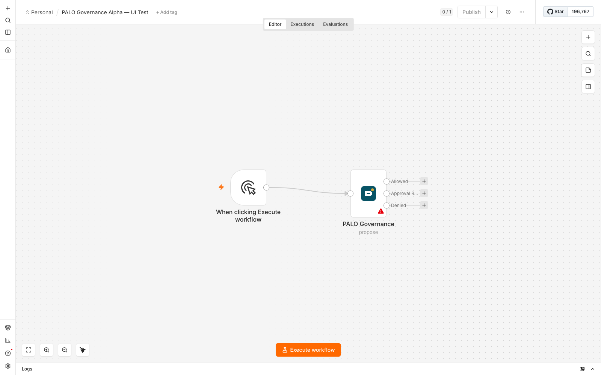
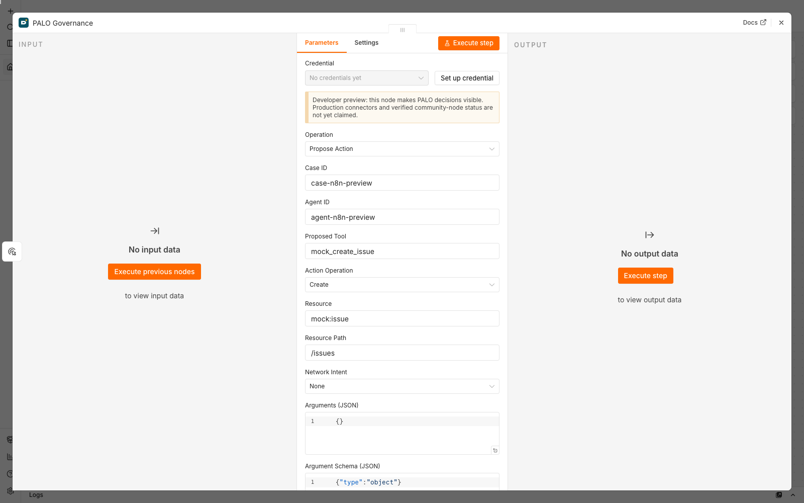
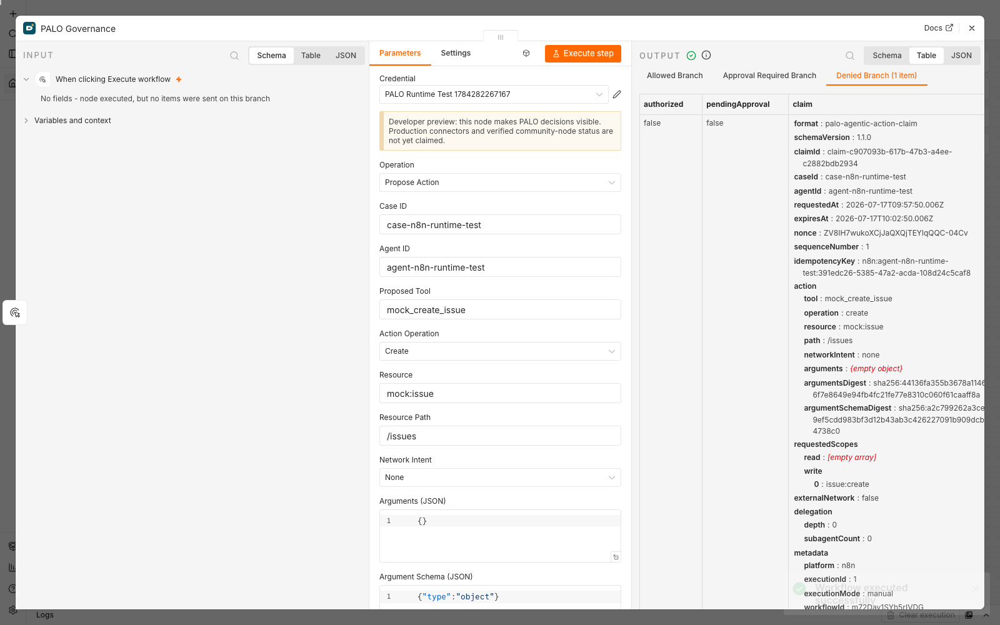

# PALO-AI n8n Alpha Test Report

Date: 17 July 2026

Package: `n8n-nodes-palo-ai` 0.1.0

Target: n8n 2.30.7

Status: passed for isolated developer-preview evaluation; not production-ready

## Scope

This report records the evidence used to decide whether the connector source is ready to be published as an architecture/installable alpha. It does not establish security assurance, n8n verification, production support or an unavoidable execution boundary.

## Gates completed

| Gate | Result | Evidence |
| --- | --- | --- |
| Official scaffold | Pass | Generated with `npm create @n8n/node` and `@n8n/node-cli` 0.39.3 |
| Strict community-node lint | Pass | `npm run lint` |
| TypeScript build | Pass | `npm run build` |
| Contract utility tests | Pass | Canonicalization, digests, decision routing, immutable claim, scope parsing and URL validation |
| Package inspection | Pass | `npm pack`; 17 files, 11.4 kB compressed, 43.6 kB unpacked |
| Development canvas load | Pass | Node rendered in n8n 2.30.7 with Allowed, Approval Required and Denied outputs |
| Tarball installation | Pass | `.tgz` installed in a clean disposable n8n user folder |
| Package registration | Pass | n8n exposed `n8n-nodes-palo-ai.paloGovernance` through its node-types endpoint |
| Credential handling | Pass | PALO API credential created and encrypted by n8n; secret absent from node output |
| Live gateway call | Pass | Installed node called the authenticated PALO Gateway on a local isolated test network |
| Fail-closed runtime behavior | Pass | Missing agent profile produced a successful workflow execution on the Denied output, with `authorized: false` |

## Real editor evidence







## Observed limitation

The manually installed local tarball registered successfully and could be imported and executed, but it did not appear in the node-creator search because this sideloaded test does not create n8n's package-manager installation record. This must be re-tested through the normal community-package installation path after the npm package exists. Until then, do not claim catalog discoverability or n8n verification.

## Publication decision

- GitHub architecture preview and source: **eligible**.
- Local installable tarball: **eligible for isolated evaluation**.
- npm public release: **deferred** until npm authentication/trusted publishing is configured and the post-publish community-package installation test passes.
- n8n template submission or connector verification request: **deferred** until npm installation, catalog discovery, compatibility and feedback gates pass.

## Reproduction

```bash
cd packages/n8n-nodes-palo-ai
npm ci
npm run verify
npm pack
```

Use only a disposable self-hosted n8n instance, the local PALO reference gateway, mock data and reversible actions.
