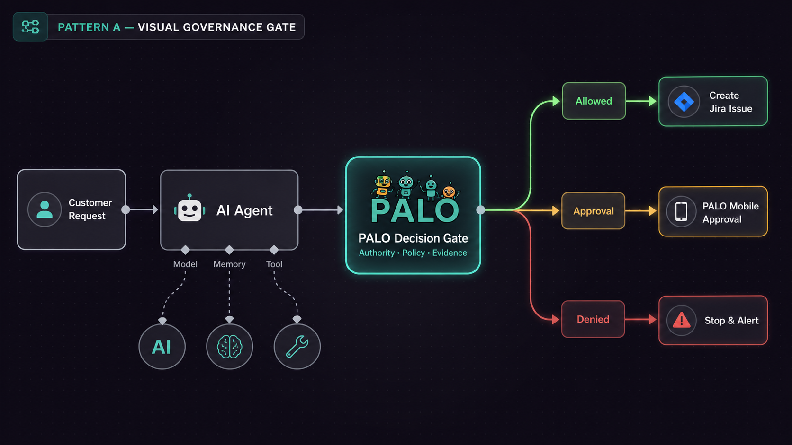
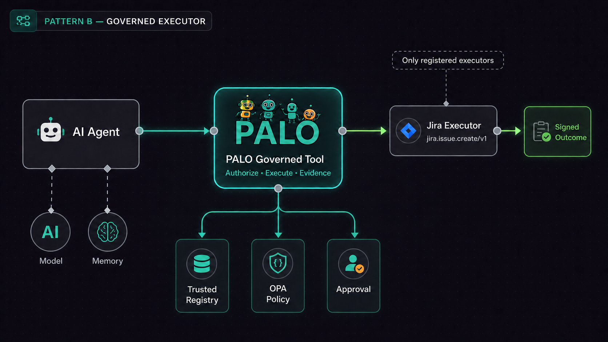
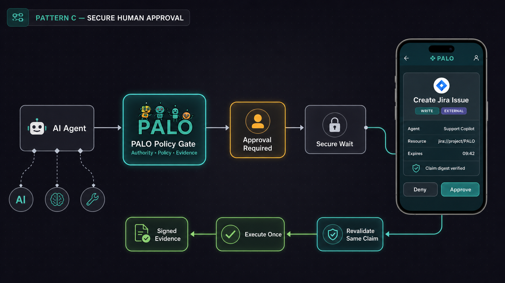
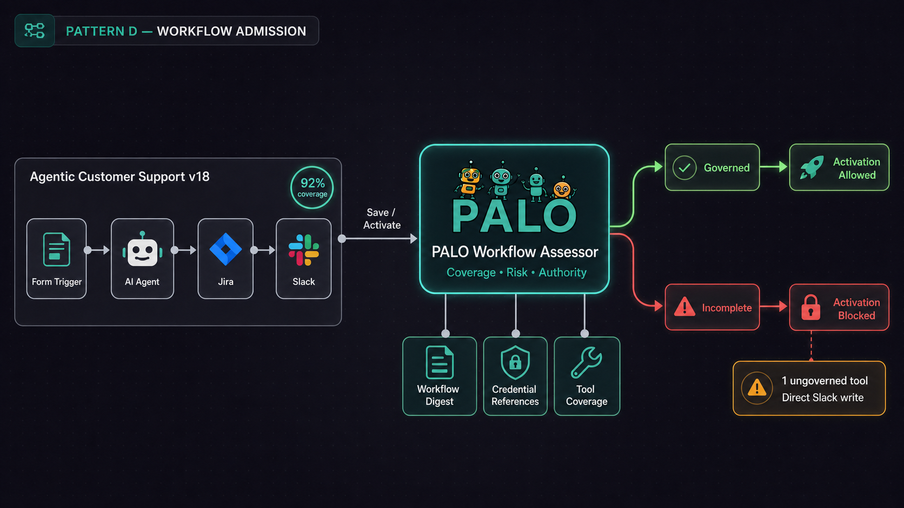
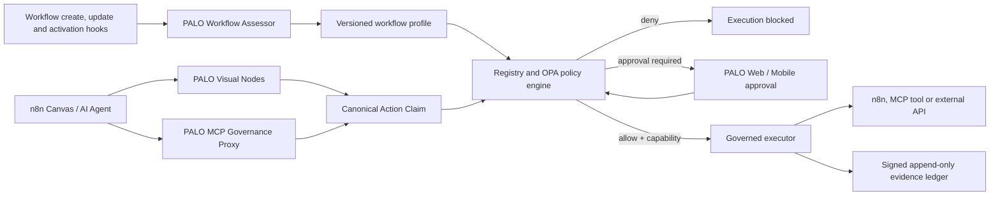

# PALO-AI Governance Control Plane for n8n and Agentic Automation Platforms

Status: architecture preview updated for the PALO-AI v2.5 full-cycle developer preview. The patterns include implemented reference prototypes and future production controls; none is represented as production-ready.

> **PALO-AI is an emerging governance control plane for n8n and agentic automation platforms, designed to make authority, policy enforcement, human oversight and cryptographic evidence visible and enforceable.**

For runnable setup and current limitations, use the [PALO-AI Governance Integration Guide](palo-ai-governance-integration-guide.md) and [Full-Cycle Assurance Guide](palo-ai-full-cycle-assurance.md). The v2.4.1 technical assessment remains the production-readiness baseline.

## Product boundary

n8n orchestrates what an automation does. PALO-AI governs whether an identified agent or automation is authorized to propose and execute a specific action, under which policy, with which human oversight, and with which evidence.

PALO-AI complements native n8n security, access control, guardrails and human-review features. It does not replace platform hardening, credential security, network controls, legal review or organization-owned accountability.

## Design principles

1. **One trusted decision point.** n8n connectors submit canonical Action Claims to the PALO Gateway; they do not evaluate authoritative policy or sign evidence locally.
2. **Decision is not execution.** A visual allow/deny node is advisory unless execution is bound to a short-lived capability or performed by a governed executor.
3. **The exact action is approved.** Approval binds to the digest of one immutable claim. Resume never regenerates the claim, arguments, nonce or idempotency material.
4. **Credentials stay with executors.** Agents and PALO claims use credential references and redacted arguments, never raw secrets.
5. **Evidence follows outcome.** An allowed decision is not evidence of successful execution. The ledger records decision, approval and verified outcome as distinct events.
6. **Fail closed by deployment profile.** Missing profiles, malformed claims, unavailable policy and expired capabilities deny execution in enforced profiles.
7. **Portable governance semantics.** Platform adapters map vendor-specific workflow data to the same versioned PALO contracts.

## Four visual integration patterns

### Pattern A — Visual Governance Decision Gate

**Enforcement class:** advisory prototype unless paired with Pattern B or Pattern D.



```text
[Proposed Action] -> [PALO Decision Gate]
                         |-- allowed ----------> [Explicit next step]
                         |-- approval required -> [Approval flow]
                         `-- denied -----------> [Stop and alert]
```

The node submits a canonical Action Claim to the trusted PALO Gateway. It exposes distinct decision branches and human-readable reasons. It is valuable for workflow transparency and prototyping, but it can be removed or bypassed by a workflow editor and must not be called an execution interceptor on its own.

### Pattern B — PALO Governed Executor

**Enforcement class:** implemented reference prototype in v2.5; production hardening and connector certification remain open.



```text
[AI Agent] -> [PALO Governed Tool]
                    |
                    v
          [Registry + schema + OPA]
                    |
          [Approval when required]
                    |
                    v
          [Allowlisted executor]
                    |
                    v
             [Outcome evidence]
```

The agent can call only a PALO-governed tool. It supplies a registered `executorId` and schema-valid arguments. The gateway resolves the executor in the trusted registry, evaluates the immutable claim, obtains approval when required, and performs or delegates the action through an unavoidable execution path.

An arbitrary `targetTool` string is not sufficient. Production executors require a versioned registration, an argument schema, an authority profile, allowed hosts and scopes, credential isolation, timeout and retry semantics, and evidence mapping.

### Pattern C — Digest-Bound Human Approval and Secure Resume

**Enforcement class:** approval-state prototype; authenticated delivery and resume remain specified.



```text
[Pending Action] -> [PALO Approval API] -> [PALO Web or Mobile]
                            ^                       |
                            |                 approve / deny
                            |                       |
                            `---- signed result ----'
                                      |
                         [Revalidate immutable claim]
                                      |
                              [Secure n8n resume]
```

The mobile client never receives authority to execute a tool and should not call an exposed n8n resume URL directly. It resolves an approval through PALO using authenticated reviewer identity. The PALO backend verifies the reviewer, device/session, claim digest, expiry and terminal state before issuing a one-time resume signal. The same claim is evaluated again immediately before execution.

This pattern should integrate with n8n's native human-review and wait semantics rather than duplicate their workflow lifecycle.

### Pattern D — Workflow Admission and Continuous Governance

**Enforcement class:** specified self-hosted/OEM enforcement pattern.



```text
[Create or update workflow]
             |
             v
   [PALO Workflow Assessor]
             |
   [Coverage + risk + profile]
        |                |
     complete         incomplete
        |                |
 [versioned digest]  [block activation]
        |
 [pre-execution verification]
```

The assessor analyzes workflow JSON, agent and tool connections, Code or Execute Command nodes, credential references, external hosts, webhooks, destructive operations, MCP exposure and missing governance coverage. A backend hook can reject activation or execution when the required PALO profile, workflow digest or governed execution path is absent.

This is the layer that turns a collection of optional nodes into instance-level governance.

## Reference architecture



## n8n adapter contract

Every n8n action should add platform correlation metadata to the canonical PALO Action Claim:

- instance and tenant identifier;
- project and workflow identifier;
- published workflow version and workflow digest;
- execution identifier and execution mode;
- node identifier, node type and node version;
- run index and input item index;
- credential reference, never credential material;
- registered executor identifier;
- tool, operation, resource, normalized path and host;
- explicit network intent: `none`, `read`, `write` or `bidirectional`;
- arguments and trusted argument-schema digest;
- data classification, reversibility and external-communication indicators where applicable.

## Proposed n8n package

The target community package is `n8n-nodes-palo-ai` and should contain:

- `PALO Assess Workflow`;
- `PALO Governance Gate`;
- `PALO Approval`;
- `PALO Governed Action`;
- `PALO Governed MCP Tool`;
- `PALO Evidence`;
- a dedicated encrypted n8n credential type;
- node versioning, icons, lint, unit tests, installation tests and npm provenance;
- three reference workflow templates.

The community package remains separable from the self-hosted enforcement package, which supplies backend hooks, the MCP proxy and deployment configuration.

## Deployment profiles

### Developer preview

- n8n;
- PALO Gateway and official-SDK MCP server;
- OPA;
- PALO-owned SQLite volume;
- localhost or isolated test network only;
- no consequential tools, sensitive data or production credentials.

SQLite is never shared with n8n. Mobile biometrics may protect access to the client but do not constitute a cryptographic reviewer signature. The current evidence prototype uses server-side HMAC keys.

### Enforced self-hosted target

- n8n with PALO backend hooks;
- PALO Gateway and MCP proxy replicas;
- OPA policy bundles with version and provenance;
- PostgreSQL transactional state and evidence outbox;
- organization-owned KMS/HSM keys;
- OAuth/OIDC workload and reviewer identity;
- TLS, rate limiting, observability, backup and recovery;
- one-time capability consumption and distributed idempotency.

### Enterprise/OEM target

- embedded governance coverage panel and node badges;
- SSO, RBAC and separation of administrator, agent, reviewer and auditor roles;
- signed policy distribution and environment promotion;
- high-availability approval and evidence services;
- retention, export, external anchoring and assurance controls.

## Out-of-the-box policy packs

1. **Observe Only** — assessment and evidence with no write authority.
2. **Human Controlled** — approval for external communications, writes, deletion and purchases.
3. **Enterprise Baseline** — host allowlists, scope restrictions, credential references and separation of duties.
4. **Regulated Data** — declared purpose, redaction, approval obligations and retention controls.
5. **Agent Team** — roles, delegation depth, subagent limits, task leases and conflict handling; specified only in v2.4.1.
6. **Vibe Coding** — unavoidable gates for shell, filesystem, Git, deployment and secret access; prototype metadata only in v2.4.1.

## Delivery sequence

1. Publish this architecture and collect interoperability feedback.
2. Package the current visual decision gate with credentials, explicit network intent and immutable-claim resume.
3. Add n8n workflow correlation metadata and distributed connector tests.
4. Implement workflow assessment and activation/pre-execution hooks.
5. Implement the governed executor registry and one-time capability consumption.
6. Integrate authenticated Web/mobile approval and secure resume.
7. Replace preview storage and identity controls for a distributed staging E2E.
8. Request n8n community-node verification only after package and provenance requirements are met.

## Public claim discipline

Use:

> PALO-AI proposes a visual and enforceable governance control plane for n8n and similar agentic automation platforms. The v2.4.1 developer preview publishes contracts, policy examples and reference runtime components for evaluation.

Do not yet use:

- “production security boundary”;
- “biometrically signed execution evidence”;
- “exactly-once execution”;
- “certified n8n connector”;
- “the standard” or “de facto standard”;
- “all n8n tool calls are intercepted” without the enforced deployment profile.

## n8n references

- [Creating and deploying community nodes](https://docs.n8n.io/integrations/creating-nodes/overview/)
- [External hooks](https://docs.n8n.io/hosting/configuration/external-hooks/)
- [Human-in-the-loop for AI tool calls](https://docs.n8n.io/advanced-ai/human-in-the-loop-tools/)
- [Instance-level MCP server](https://docs.n8n.io/advanced-ai/mcp/accessing-n8n-mcp-server/)
- [Community-node verification guidelines](https://docs.n8n.io/integrations/creating-nodes/build/reference/verification-guidelines/)
- [Sustainable Use License](https://docs.n8n.io/sustainable-use-license/)
