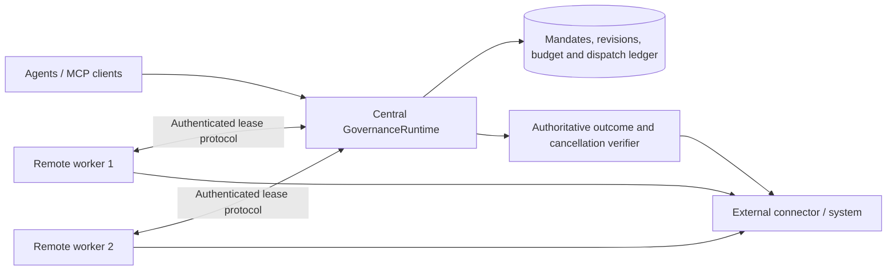

# PALO swarm execution across processes

Publication note, 17 September 2026: this guide describes a separately evaluated, unreleased swarm source snapshot. The published PALO-AI server and ANS branch do not yet include this extension. Reproduction requires the matching maintainer snapshot; the commands below are not available in the published baseline. See the [dated status and evidence](palo-status-2026-09-17.md).

Status: unreleased reference implementation. Worker execution now runs across process and network boundaries, with versioned membership and verifiable cancellation. One central GovernanceRuntime owns the SQLite ledger and all budget decisions. This is not an HA controller, replicated database or production deployment qualification.

```sh
npm run test:swarm
npm run demo:swarm:distributed
npm run demo:swarm:distributed -- --output output/swarm-governance/distributed-verification.json
```

The demonstration launches real child processes, serves the authenticated worker API over loopback HTTP, and uses a synthetic external-effects database. It proves shared-budget enforcement, member admission/removal, a supported connector stopping before its effect, and a network partition that remains unknown until authoritative reconciliation. Tests also cover workers that ignore cancellation, worker crashes, stale leases and cross-tenant requests.



## Authoritative coordination

`SwarmDispatch` provides a durable queue linked to the existing execution intent and reserved exposure. Worker identities are provisioned by the operator with unique credentials, a tenant and an executor allowlist. Workers cannot choose their authenticated identity, change their tenant, increase the budget or grant authority locally. The worker API accepts HTTPS, with HTTP restricted to loopback.

Workers claim a job, receive an expiring lease bound to the execution, worker and fence, and consume a single-use start permit before calling their connector. A second start is denied. Heartbeats check live authority and cancellation; checkpoints require a fresh successful response immediately before a connector's effect. The coordinator rechecks membership when dispatching and starting queued work. Already-started members may finish across an admission revision if their own ancestry remains valid.

A worker crash, expired lease, missed heartbeat or unavailable coordinator does not create another execution attempt. The charge remains committed and uncertain work is held for review. Fences bind a particular execution attempt; they do not claim cross-resource fencing in an arbitrary external database. A replica with an independent ledger must never be treated as another member of the same authority.

## Dynamic membership

The initial mandate stays immutable. `palo_admit_swarm_members` accepts a [`palo-swarm-membership-change`](../schemas/palo-swarm-membership-change.schema.json) with an idempotent change ID, expected current membership digest, registered profiles, parents and reason. The MCP handler requires the authenticated tenant and `palo:admin`; the verified actor is recorded in the revision and signed event chain.

Admission compares and swaps the membership digest inside a transaction. It checks ancestor profiles, delegation depth, allowed roles, direct-member ceilings and authority narrowing. New profiles must retain identical argument schemas for inherited tools: arbitrary JSON Schema implication is not assumed. The total historical membership ceiling is 1,000. Budget and original objective are never reset. Reusing an existing or revoked identity, moving it to another swarm, changing its parent or rewriting an old revision is rejected.

After the first admission, every fresh Action Claim must bind both digests:

```json
{
  "metadata": {
    "swarm": {
      "swarmId": "swarm-example",
      "mandateDigest": "sha256:<immutable mandate digest>",
      "membershipDigest": "sha256:<current membership digest>"
    }
  }
}
```

Admission revokes issued capabilities and invalidates stale pending claims. Removal uses `palo_revoke_swarm_authority`, which includes dynamically admitted descendants and retains immutable revocation records. A replacement process needs a new registered identity and an explicit admission. Administrative admission does not spawn or attest that process.

## Cancellation and external effects

`palo_cancel_swarm_execution` requests cancellation of one execution; subtree or coordinator revocation automatically requests cancellation of affected running work. All mutations require `palo:admin` on OIDC MCP. Status and evidence are visible through `palo_get_swarm_status`.

| Status | Meaning |
| --- | --- |
| `requested` | Durable request; no stop guarantee yet |
| `confirmed` | The coordinator prevented dispatch, or a separately provisioned verifier confirmed the external operation stopped with no effects |
| `too_late` | The connector completed, or an observation found existing effects |
| `unknown` | No reliable confirmation, including a partition or expired lease |
| `unsupported` | No authoritative cancellation verifier is configured for worker acknowledgements |

A worker receives an `AbortSignal` and an async `checkpoint` function. A conforming connector must cancel its external job or abort before committing, then return from its handler. Merely receiving a signal or returning an acknowledgement does not establish containment. The operator supplies `verifyCancellation` to inspect the authoritative external job and effect state; confirmation requires a matching execution ID, stopped state, absence of effects and an observation digest. Verification is time bounded and observations are signed into the swarm event chain.

If a connector completes after a cancellation request, completion takes precedence and the result is `too_late`. If connectivity disappears after a worker stops, the initial result stays `unknown`; `dispatch.reconcileCancellation(executionId, tenantId)` can later obtain authoritative confirmation. Reconciliation can downgrade an earlier confirmation if later evidence contradicts it.

Cancelled work keeps its budget charge and normal execution/outcome evidence. A confirmed stop with no effects does not itself hold unrelated members. The cancelled action retains a review outcome because its originally requested effect was not verified. Unknown or failed outcomes still hold the swarm. No automatic rollback, budget refund or resubmission is performed.

## Host integration

The worker service is opt-in. It is not automatically enabled by the standard MCP server or Knowledge Reader. The host registers executor and verifier manifests as usual, then provisions a dispatcher and worker credentials:

```js
import { SwarmDispatch } from "../packages/palo-mcp-server/swarm-dispatch.js";
import { listenSwarmWorkerApi } from "../packages/palo-mcp-server/swarm-worker-transport.js";

const dispatch = new SwarmDispatch(runtime, {
  leaseMs: 3000,
  executionTimeoutMs: 60000,
  verifyCancellation: inspectAuthoritativeExternalJob
});
runtime.executorHandlers.set(executorId, dispatch.executor(executorId));
const api = await listenSwarmWorkerApi({
  dispatch,
  credentials: [{ workerId, tenantId, executorIds: [executorId], token }],
  host: "127.0.0.1",
  port: 8081
});
```

Worker processes use `createSwarmWorkerClient` and `runSwarmWorkerOnce` with operator-provisioned handlers. For non-loopback binding, supply `tls: { key, cert }` and an HTTPS URL. The demo worker and its synthetic identity verifier are test fixtures, not deployment authentication or a payment integration. Existing cryptographic Action Claim verification remains required separately from worker transport authentication.

## Production work still required

This implementation establishes central coordination of distributed workers. It does not establish controller failover, multi-primary consensus, database replication, network-partition availability, automatic worker reassignment, managed key custody, credential rotation, cloud workload attestation or tenant-isolated storage. SQLite files must stay local to their authority; do not share them through a network filesystem.

Hard cancellation is possible only where the actual external API and connector support it and the verifier can establish a terminal state. An irreversible effect already committed requires a separately governed compensating action. A lost coordinator connection cannot prove that an uncooperative external system stopped. Production admission remains denied until the deployment supplies the independently verified capabilities it requires.
