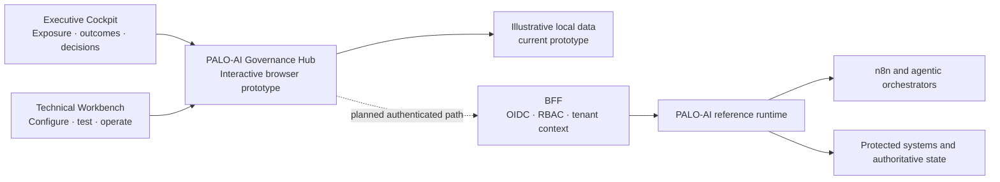
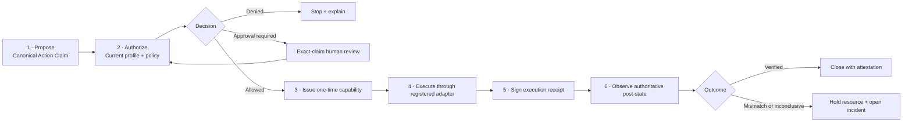

# PALO-AI Governance Hub — website copy draft

Status: English copy deck for the implemented role-based Governance Hub prototype, updated 19 July 2026.

The Governance Hub user interface is now implemented and tested as a React/Vite prototype using illustrative local data. This copy is not evidence of a live runtime connection or production security boundary. Any live page must retain the developer-preview boundary below until the capability matrix and independent assurance gates support stronger claims.

## SEO and sharing metadata

**Page title**

PALO-AI Governance Hub | Govern Agent Authority and Verify Outcomes

**Meta description**

Explore a role-based control plane for agentic automation: executive assurance, technical policy operations, human oversight and verifiable outcomes across n8n and similar platforms.

**Canonical path proposal**

`https://paloframework.org/PALO_AIGovernanceHub.html`

**Open Graph title**

PALO-AI Governance Hub — from permitted actions to verified outcomes

**Open Graph description**

One governance source of truth, two role-based views: an Executive Cockpit for exposure and decisions, and a Technical Workbench for authority, policy, execution and outcome assurance.

**Suggested search phrases**

- agentic AI governance control plane
- n8n AI agent governance
- AI agent authority and human approval
- agent workflow policy enforcement
- post-execution AI assurance
- MCP governance and OPA policy

## Navigation labels

- Overview
- Executive Cockpit
- Technical Workbench
- How it works
- Evidence
- Current status
- Documentation
- Design partners

Primary navigation CTA: **Explore the developer preview**

Secondary navigation CTA: **Review the architecture on GitHub**

## Announcement ribbon

**PALO-AI v2.5 developer preview** — full-cycle reference contracts, runtime and an interactive mock-data Governance Hub are available for isolated evaluation. The Hub is not yet connected through a production BFF and is not a production service.

## Hero

### Eyebrow

PALO-AI GOVERNANCE HUB

### Headline

Make agent authority visible. Make outcomes reviewable.

### Supporting copy

PALO-AI is an emerging governance control plane for agentic automation. It gives executive and technical teams a shared view of who may act, under which policy, with which human oversight, and whether the real-world result matched what was approved.

It does not replace n8n or another orchestration platform. It adds a portable governance lifecycle around protected actions.

### Primary CTA

**Choose your view**

Helper: Start with the decision you need to make, not with a JSON file.

### Secondary CTA

**Run the safe hands-on demo**

Helper: Compare a direct tool call with a governed, verified path using synthetic data.

### Tertiary link

**See what is implemented, prototyped and still specified →**

### Hero proof line

Current repository evidence includes 12 agentic JSON contracts, 19 MCP reference tools, 13 Rego policy tests and 23 Node.js runtime tests. These counts describe the current developer-preview repository; they are not production-readiness or certification claims.

## The problem

### Headline

Permission is necessary. It is not proof of correctness.

### Copy

An agent can choose a valid tool, present valid arguments and pass an authorization policy—and still produce the wrong result because its source state was stale, its assumption was incorrect or the external system behaved differently than expected.

Most governance views stop at **allowed**. PALO-AI extends the lifecycle to ask a second question: **did the protected system actually reach the declared outcome?**

### Three problem cards

**Authority can remain implicit**
Tool access is often treated as permission, even when the actor, resource, tenant and limits are unclear.

**Approval can lose its context**
A reviewer may approve a label while the arguments or target change before execution.

**Logs can record the wrong thing well**
An execution log proves that something ran. It does not prove that the intended effect occurred or that forbidden effects did not.

## One source of truth, two role-based views

### Shared copy

The Executive Cockpit and Technical Workbench do not create separate interpretations of risk. They present the same Action Claims, policy decisions, approvals, execution receipts, outcome attestations and incidents at the level each role needs.

Progressive disclosure keeps the interface understandable:

1. plain-language explanation;
2. structured decision context;
3. linked evidence and timeline;
4. raw contracts, policy, digests and logs.

## Executive Cockpit

### Eyebrow

FOR EXECUTIVES, BUSINESS OWNERS AND RISK LEADERS

### Headline

See where agentic operations are controlled—and where assurance is still missing.

### Copy

The Executive Cockpit is designed to answer five questions without requiring knowledge of JSON, Rego or MCP:

1. What is happening now?
2. Where is the organization exposed?
3. Which outcomes are verified, mismatched or inconclusive?
4. Which decisions require accountable human ownership?
5. What changed since the previous review?

### Executive modules

**Today**
Portfolio-level coverage, verified outcomes, open holds, inconclusive verification and emerging bypass exposure.

**Exposure Map**
Explore by business area, platform, workflow, agent, data class and impact level. Every summary can be traced to the underlying evidence.

**Decision Inbox**
Accept a time-bound residual risk, suspend a workflow, assign an owner or authorize a controlled pilot. Routine tool-call approval remains with designated reviewers.

**Assurance View**
Keep four dimensions separate instead of hiding uncertainty in one score: governance coverage, authority assurance, outcome assurance and operational health.

**Board Report**
Generate a review packet with current exposure, changes, incidents, remediation and decisions required. The report states its evidence boundary and never represents a developer preview as certification.

### Executive CTA

**Review the executive concept**

Supporting link: **Download the Executive Briefing →**

## Technical Workbench

### Eyebrow

FOR PLATFORM, SECURITY, POLICY AND AUTOMATION TEAMS

### Headline

Define the intent. Generate the contracts. Test every decision path.

### Copy

The Technical Workbench should begin with business and operational intent—not with an empty policy editor.

### Guided setup questions

- What should this agent or workflow be able to do?
- Which resource, path, tenant and host can it affect?
- Which actions must always be denied?
- When is human approval required?
- What state must be true before execution?
- What result must be observed afterward?
- Which changes must never occur?
- Who owns a mismatch or inconclusive outcome?

### Proposed wizard

1. **Connect environment** — n8n, MCP client, custom application or another adapter.
2. **Discover agents and tools** — import or map agents, workflows, tools and connectors.
3. **Define purpose and ownership** — business purpose, accountable owner, tenant and environment.
4. **Bound authority** — tools, operations, resources, paths, hosts and network intent.
5. **Select oversight** — automatic execution, exact-claim approval or denial.
6. **Define the Effect Contract** — preconditions, expected effects, forbidden effects and authoritative verifier.
7. **Simulate failure paths** — deny, stale state, replay, mismatch, unavailable verifier and recovery.
8. **Review and publish** — version, approve and deploy through controlled promotion.

### Generated artifacts

The wizard is intended to generate editable starting points for:

- Agent and Authority Profiles;
- canonical Action Claim mappings;
- Effect Contracts;
- Rego policies and tests;
- MCP and REST integration configuration;
- n8n workflow configuration;
- deployment and review checklists.

Generated code must remain visible through **View generated contract** and **View generated policy**. The GUI reduces cognitive friction; it does not conceal the enforcement boundary.

### Technical modules

**Topology Map**
Trace the agent, governance gate, policy, approval, capability, executor, verifier and target credential path. Highlight direct credentials or alternate nodes that can bypass governance.

**Policy Builder**
Compose readable conditions, inspect generated Rego v1, run fixtures and compare policy versions before promotion.

**Effect Contract Builder**
Declare state before execution, expected state after execution and state that must never change using a closed predicate vocabulary.

**Action Explorer**
Follow one immutable action from proposal to decision, approval, capability, receipt, authoritative observation, attestation and incident resolution.

**Test Lab**
Exercise allowed, denied, approval-required, replay, stale-state, wrong-effect, verifier-unavailable and restart-recovery scenarios.

### Technical CTA

**Open the integration guide**

Supporting links:

- **Review the full-cycle assurance model →**
- **Inspect the capability matrix →**
- **Run the n8n developer-preview demo →**

## How the governed lifecycle works

### Lifecycle explanation

PALO-AI treats **allowed** and **verified** as different states. Authorization checks whether an action is permitted. Outcome assurance checks whether authoritative state satisfies the immutable Effect Contract after execution. A mismatch or uncertain result becomes visible work, not a successful green check.

## Use with n8n and similar platforms

### Headline

Keep orchestration where it belongs. Put protected authority behind a governed path.

### Copy

n8n coordinates triggers, agents, data and workflow steps. PALO-AI supplies portable authority profiles, policy evaluation, exact-claim approval and outcome-assurance contracts.

The current `n8n-nodes-palo-ai` 0.2 package contains:

- **PALO Governance** — a decision-only visual gate with Allowed, Approval Required and Denied outputs;
- **PALO Governed Action** — a full-cycle reference node with Verified, Review Required, Denied and Execution Failed outputs.

The package is unpublished and not n8n-verified. A visual gate is advisory when a workflow can retain another direct credential path. For consequential use, target credentials must remain behind an independently reviewed governed executor and workflow-admission controls.

### Cross-platform message

The governance contracts are designed to be portable. The repository currently includes an authenticated Dify example and MCP transports; production adapters for Dify, Copilot Studio, LangGraph and other platforms remain future integration work unless their capability status explicitly changes.

## Evidence, not a single confidence score

### Headline

Show the signal. Preserve the uncertainty.

### Four executive measures

| Dimension | Question answered | Example evidence |
| --- | --- | --- |
| Governance coverage | Can protected actions bypass the governed path? | Workflow and credential topology review |
| Authority assurance | Is the actor's authority current and bounded? | Versioned profile, scopes and policy decision |
| Outcome assurance | Did the intended result occur? | Receipt, authoritative observation and attestation |
| Operational health | Can the control path operate and recover safely? | Incidents, holds, recovery and service health |

### Measurement caution

Do not collapse these dimensions into a universal “PALO score.” A high authorization rate may hide weak verification coverage; a healthy runtime may coexist with a bypassable credential path.

## What exists today

### Current developer-preview evidence

- Action Claim 1.2 and resource-bound Effect Contract schemas;
- Rego v1 default-deny reference policy and tests;
- official-SDK MCP server over stdio;
- bearer-authenticated Streamable HTTP prototype with host allowlisting and tool filtering;
- one-time capability, in-process executor and authoritative verifier reference flow;
- signed execution receipts and outcome attestations using environment-provided HMAC keys;
- SQLite WAL registry, transactional outbox and append-only hash-chain reference ledger;
- mismatch and inconclusive incident lifecycle with resource holds;
- single-instance restart recovery;
- n8n 0.2 source package and synthetic hands-on demonstration.

### What the proposed GUI adds

- role-based executive and technical experiences;
- plain-language explanations with drill-down to evidence;
- visual authority, policy and Effect Contract builders;
- topology and bypass-path inspection;
- test orchestration and reusable templates;
- portfolio reporting and decision workflows.

These GUI capabilities remain proposed until implementation evidence is added to the public capability matrix.

## Current boundary

### Headline

Developer preview means test the model—not trust it with consequential operations.

### Required disclaimer

PALO-AI v2.5 is a developer preview and reference implementation for isolated evaluation with synthetic data and non-consequential tools. It is not a production authorization service, an independently assessed security boundary, an n8n-certified or verified connector, a compliance certification, a production identity or approval service, or a universal exactly-once executor.

The current reference mechanisms include shared bearer tokens, environment-provided HMAC keys, SQLite and in-process adapters. Production adoption requires organization-owned identity and RBAC, tenant isolation, KMS/HSM key custody, signed policy promotion, durable distributed state, high availability, backup and retention, connector attestation, observability, incident response and independent security and cryptographic assessment.

### Short disclaimer for cards and social previews

Developer preview. Use synthetic data and reversible actions only. No production authorization, n8n verification, certification or universal interception claim.

## Design-partner invitation

### Headline

Help test where governance becomes enforceable—and where it still creates friction.

### Copy

We are looking for three to five design partners with one disposable or isolated workflow and one mock or reversible tool action. Ideal reviewers include n8n builders, platform engineers, security architects, OPA/Rego practitioners and governance teams.

The evaluation should measure decision correctness, bypass visibility, operator comprehension, approval effort, verification coverage, latency and recovery behavior. Do not share production credentials, personal data, client names or confidential workflow exports.

### CTA

**Propose a safe design-partner evaluation**

Secondary link: **Submit architecture feedback on GitHub →**

## Frequently asked questions

### Is PALO-AI another workflow automation platform?

No. n8n and similar platforms orchestrate steps. PALO-AI is designed as a complementary governance control plane for authority, policy, human oversight, governed execution and outcome assurance.

### Does an Allowed decision mean the action was correct?

No. Allowed means the action passed the current authority and policy checks. Verified requires authoritative post-state that satisfies the bound Effect Contract.

### Does the n8n node intercept every tool call?

No. The visual gate is bypassable when another node or workflow retains direct target credentials. The 0.2 Governed Action preview calls the PALO-owned execution path, but production bypass resistance also requires credential isolation, workflow admission and independent assessment.

### Is the Governance Hub available now?

Yes, as an interactive developer-preview prototype. The Executive Cockpit and Technical Workbench are implemented with illustrative local data and can be used for demonstrations and structured usability evaluation. They are not yet connected to live runtime data and must not be presented as a production, multi-user governance service.

### Can this be used in production?

Not in its current developer-preview form. Use isolated data and non-consequential tools only.

### Does PALO-AI certify compliance with the EU AI Act or another standard?

No. PALO is a governance support framework, not a certification or legal-advice service.

## Closing section

### Headline

Start with one protected action and one outcome that matters.

### Copy

Do not begin with enterprise-wide deployment. Map one actor, one authority profile, one reversible tool action, one Effect Contract and one accountable reviewer. Test the deny path, the approval path, the wrong-effect path and recovery before considering a wider pilot.

### CTAs

Primary: **Run the safe hands-on demo**
Secondary: **Review the architecture**
Tertiary: **Join the design-partner cohort**

## Publication checklist for this page

- Replace all proposed links with verified public routes before deployment.
- Keep the words “proposed,” “developer preview,” “unpublished” and “not n8n-verified” where applicable.
- Link status claims to `agentic/capability-matrix.json`.
- Link technical behavior to `docs/palo-ai-full-cycle-assurance.md` and `docs/palo-ai-governance-integration-guide.md`.
- Show the “without PALO / with PALO” workflow visual near the problem section.
- Show a real n8n developer-preview screenshot near the integration section, with a caption that distinguishes demonstration evidence from production enforcement.
- Do not publish fabricated dashboard numbers. Use clearly labelled sample data until a live telemetry pipeline exists.
- Provide text alternatives for diagrams and screenshots.
- Keep executive surfaces read-only by default and never expose secrets or unrestricted raw arguments.
