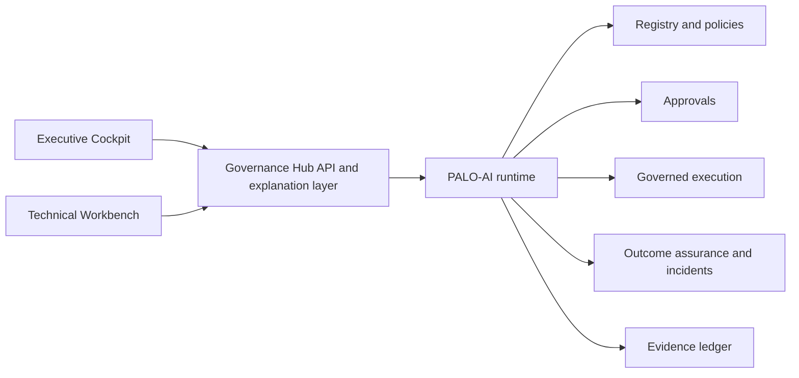
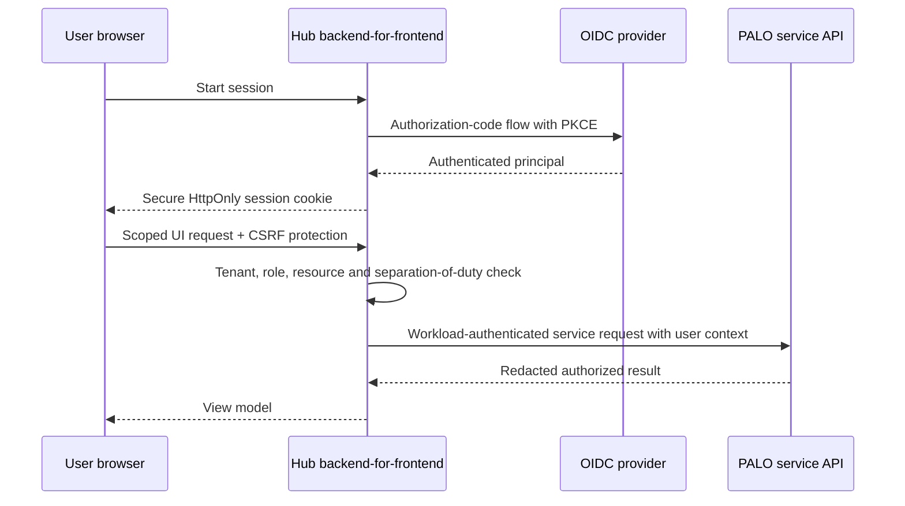

# PALO-AI Governance Hub — Product Specification

Status: proposed product experience for the PALO-AI v2.5 developer preview, updated 19 July 2026.

> **Important boundary.** This document specifies a future GUI and the backend capabilities required to support it. It does not claim that the GUI, production identity, tenant isolation, or production authorization boundary already exists. The current runtime is a developer preview for synthetic or isolated data and non-consequential tools. Current implementation status remains authoritative in [`agentic/capability-matrix.json`](../agentic/capability-matrix.json).

## 1. Product intent

The PALO-AI Governance Hub is one product with two role-aware views over the same governance lifecycle:

- **Executive Cockpit** — explains exposure, assurance outcomes, accountable ownership, and decisions without requiring knowledge of JSON, Rego, MCP, or workflow internals.
- **Technical Workbench** — lets authorized practitioners configure, test, operate, and investigate the controls that produce those outcomes.

The Hub is not a second policy engine. It is an administration, review, and explanation layer over the PALO-AI runtime and its versioned contracts.



### The decision each mode supports

| Mode | Primary decision | Product promise |
| --- | --- | --- |
| Executive | Should we accept, contain, invest, or escalate? | Turn runtime evidence into understandable exposure and accountable decisions. |
| Technical | Is this integration correctly configured, enforced, tested, and operable? | Make contracts and controls inspectable without making raw code the only entry point. |

## 2. Problem statement

Agentic automation creates two distinct questions:

1. **Was the action permitted?** Authority, policy, scope, approval, and replay controls answer this before execution.
2. **Did the action produce the promised result?** Trusted execution receipts and authoritative post-state verification answer this after execution.

The current reference implementation exposes these concepts through JSON contracts, REST endpoints, MCP tools, tests, and the n8n preview package. That is appropriate for engineering evaluation, but it creates cognitive friction for business owners and unnecessary configuration friction for technical adopters.

The Hub must make the full cycle visible without collapsing permission and correctness into one misleading status:

```text
Propose -> Authorize -> Approve -> Capability -> Execute
        -> Receipt -> Observe -> Verify -> Escalate
```

## 3. Product principles

1. **One truth, two lenses.** Both modes use the same underlying claims, decisions, receipts, attestations, incidents, and ledger entries.
2. **No single trust score.** Coverage, authority assurance, outcome assurance, and operational health remain separate dimensions.
3. **Plain language first, evidence always reachable.** Every summary must drill down to its source records and calculation window.
4. **Allowed is not verified.** The GUI must never visually equate policy permission with a correct effect.
5. **Uncertainty is visible.** `inconclusive`, unavailable, stale, and not-instrumented states cannot be rendered as success.
6. **Governance is not enforcement when bypass remains.** Each integration must expose its enforcement scope and known direct paths.
7. **Fail closed for consequential operations.** UI convenience cannot weaken runtime validation, exact-claim approval binding, or one-time capability consumption.
8. **Generated code remains inspectable.** Visual builders generate versioned artifacts; they do not replace schemas, Rego, tests, or review.
9. **Least privilege by role and tenant.** Human administration requires authenticated principals, separation of duties, and scoped access.
10. **Developer-preview honesty.** Screens and reports must identify reference mechanisms and unavailable production controls.

## 4. Scope and non-goals

### In scope

- Role-aware executive and technical navigation.
- Portfolio summaries with drill-down to evidence.
- Approval and assurance-incident work queues.
- Guided authority, policy, and Effect Contract configuration.
- Simulation and conformance testing.
- Execution and evidence timelines.
- Connector and runtime health.
- Deployment-mode visibility: Local, Hybrid, Cloud, and Private.
- Exportable executive and audit reports with provenance.

### Non-goals

- Replacing the PALO-AI policy engine or canonical contracts.
- Treating the browser as a trusted signing or credential store.
- Automatically approving consequential actions based on a composite score.
- Claiming exactly-once execution across external systems.
- Automatic rollback. Compensation remains a new governed Action Claim.
- Presenting preview bearer tokens, SQLite, environment HMAC keys, or in-process connectors as production controls.
- Certifying compliance or security through the GUI.

## 5. Personas and access roles

Personas describe user needs. Roles define permissions. One person may hold more than one role, but production deployments should enforce separation of duties for high-impact changes.

| Persona / role | Primary need | Typical permissions |
| --- | --- | --- |
| Executive sponsor | Understand exposure and decide whether to invest, accept, contain, or escalate | Read aggregated portfolio; approve risk acceptance and pilot gates; export executive report |
| Business owner | Own purpose, impact, and residual risk for a business capability | Read owned portfolio; assign accountable owners; accept scoped exceptions where authorized |
| Human reviewer | Decide a specific claim-bound approval with meaningful context | Read assigned approval; approve, deny, or cancel once; provide rationale |
| Policy engineer | Define authority, policy, Effect Contracts, and tests | Create drafts; simulate; submit for review; inspect generated JSON/Rego |
| Platform administrator | Operate runtimes, connectors, environments, and deployment | Manage environment configuration and health; provision server-side connectors; no default business approval right |
| Security operator | Investigate bypass, mismatch, replay, identity, and control failures | Read technical evidence; acknowledge incidents; place or maintain holds; propose remediation |
| Auditor / assurance reviewer | Trace claims to decisions, execution, outcome, and change history | Read-only access to immutable evidence, versions, reports, and calculation definitions |
| Integration developer | Connect code-first, MCP, n8n, or comparable platforms | Manage assigned development integrations; run synthetic tests; no production publishing without promotion authority |

### Required separation-of-duty rules

- A policy author cannot unilaterally promote a high-impact policy to production.
- A requester cannot approve their own consequential Action Claim unless an explicitly approved exception policy permits it.
- A platform administrator cannot silently grant business authority through connector configuration.
- Incident resolution and resource-hold release require an authorized principal and a recorded rationale.
- Risk acceptance must be distinct from technical remediation completion.

## 6. Information architecture

### Shared global frame

The header remains consistent across both modes:

- Organization and tenant.
- Environment: Local, Development, Staging, or Production.
- Mode switch where the principal has access.
- Time window and data freshness.
- Global search by case, agent, workflow, resource, execution, approval, or incident.
- Active preview/security-boundary notice.
- Principal identity, current role, and session controls.

### Executive Cockpit

| Area | Question answered | Core objects |
| --- | --- | --- |
| Today | What needs attention now? | Coverage exceptions, mismatches, inconclusive outcomes, open incidents, overdue decisions |
| Exposure | Where can consequential action occur without sufficient control or verification? | Business capability, workflow, agent, resource, tenant, bypass path |
| Decisions | What requires executive or business-owner action? | Risk acceptance, pilot gate, owner assignment, exception, suspension |
| Assurance | Are authority, outcomes, and operations behaving as intended? | Coverage, authorization results, attestations, incidents, recovery events |
| Portfolio | Which business areas, platforms, and owners are in scope? | Cases, environments, integrations, owners, impact classes |
| Reports | What can be shared with leadership, audit, or a design partner? | Provenance-bound snapshots, trends, decisions, limitations |

### Technical Workbench

| Area | Purpose | Core objects |
| --- | --- | --- |
| Inventory | Discover and register agents, tools, resources, policies, executors, and verifiers | Registry manifests and versions |
| Govern | Build authority profiles, policies, approvals, and Effect Contracts | Action Claim, policy, approval, Effect Contract |
| Integrate | Configure code-first, MCP, n8n, and other platform paths | Environment, connector, credential boundary, enforcement scope |
| Test Lab | Simulate allowed, denied, approval, replay, stale state, mismatch, and unavailable verifier cases | Fixtures, test runs, expected/actual results |
| Operations | Inspect runtime, policy, connector, queue, database, and key health | Health signals, outbox/recovery status, version and digest |
| Investigate | Trace execution and assurance incidents | Decision, capability, receipt, attestation, incident, resource hold |
| Evidence | Verify and export lifecycle evidence | Ledger, signatures, chain verification, retention metadata |
| Changes | Review and promote versioned configuration | Draft, review, approval, publish, rollback metadata |

## 7. Core experiences

### 7.1 Executive Today

The default page contains no protocol or schema terminology. It presents:

- consequential actions observed in the selected period;
- governed-path coverage and known bypasses;
- outcome distribution: verified, mismatch, inconclusive, not verified, and execution failed;
- open assurance incidents and aged resource holds;
- decisions due, owners missing, and control telemetry unavailable;
- comparison to the previous equivalent period, with denominator and freshness visible.

Each card must answer **what changed**, **why it matters**, **who owns it**, and **what action is available**.

### 7.2 Exposure Map

Users navigate from business domain to platform, workflow, agent, protected resource, and individual execution. Filters include tenant, environment, owner, impact class, policy version, connector, and assurance state.

Red indicates a defined adverse condition, not merely missing data. Missing instrumentation uses a distinct neutral/amber state and explanatory label.

### 7.3 Decision Inbox

The inbox separates:

- **Operational approvals** — exact Action Claims assigned to reviewers.
- **Assurance incidents** — mismatch or inconclusive outcomes requiring investigation.
- **Risk decisions** — exceptions, pilot gates, and residual-risk acceptance.

The first two have current runtime support at prototype level. Risk-decision workflow is a missing backend capability and must not be simulated by reusing Action Claim approval records.

### 7.4 Guided Governance Builder

The Workbench starts from intent rather than raw JSON:

1. What is the agent trying to achieve?
2. Which tenant, environment, resource, and operation are in scope?
3. Which tools and network destinations may be used?
4. What arguments and limits are valid?
5. When is approval required, and by which role?
6. What must be true immediately before execution?
7. What must change, and what must never change?
8. Which authoritative verifier can observe the result?

The builder generates inspectable, versioned artifacts and tests. A user can switch among plain-language, structured, generated code, and evidence views.

### 7.5 Action Explorer

The explorer shows one immutable lifecycle:

```text
10:42:01 Claim normalized and accepted
10:42:01 Policy decision: approval required
10:43:18 Exact claim approved by reviewer
10:43:19 One-time capability issued
10:43:19 Execution intent persisted and capability consumed
10:43:20 Signed receipt recorded
10:43:21 Authoritative post-state observed
10:43:21 Outcome: mismatch
10:43:22 Assurance incident opened; resource held
```

Every step links to its source contract, digest, principal, version, and timestamp. The timeline distinguishes runtime statements from external observations.

### 7.6 Test Lab

Required scenarios:

- valid low-impact allowed action;
- default deny for missing or malformed authority;
- approval-required action and exact-claim resume;
- changed arguments after approval;
- duplicate nonce, conflicting idempotency key, and stale sequence;
- expired claim and expired capability;
- stale authoritative pre-state;
- expected effect verified;
- forbidden or wrong effect detected;
- verifier unavailable or malformed state;
- connector failure and startup recovery;
- direct/bypass path test where the deployment supports it;
- tenant substitution and unauthorized role tests once identity is implemented.

## 8. Progressive disclosure and explanation model

The same event has four representations:

| Level | Audience | Example |
| --- | --- | --- |
| 1. Plain language | Executive / business owner | “Price update denied because the requested change exceeded this agent’s limit.” |
| 2. Structured explanation | Reviewer / operator | Agent, tenant, resource, operation, limit, policy version, and required action |
| 3. Evidence | Auditor / investigator | Claim digest, approval, decision, capability, receipt, attestation, incident |
| 4. Raw technical | Engineer | Canonical JSON, Rego result, signature metadata, ledger entry, runtime log reference |

Explanation rules:

- Never infer a reason not returned or derivable from recorded evidence.
- Label generated plain-language text as a rendering of structured evidence, not a new decision source.
- Show timestamps, environment, policy/profile versions, and calculation window.
- Redact secrets and sensitive arguments by policy before they enter summaries, exports, logs, or analytics.
- Preserve a stable link from summaries to the immutable source record.

## 9. KPI and KRI model

The Hub must not publish a single composite “PALO score.” A high aggregate can hide a critical bypass or unverified consequential workflow.

### 9.1 Governance coverage

| Metric | Definition | Guardrail |
| --- | --- | --- |
| Governed-path coverage | Consequential action paths proven to require PALO / known consequential action paths | Unknown inventory remains a separate count; it is not silently excluded |
| Bypass-free integration rate | In-scope integrations with no known direct tool or credential path / assessed integrations | Only counted after an evidence-backed bypass assessment |
| Authority-profile coverage | Active agents with valid scoped profiles / discovered active agents | Expired, missing, and unassessed profiles reported separately |
| Effect Contract coverage | Consequential action types with an active Effect Contract and verifier / in-scope consequential action types | A policy-only gate does not count as outcome coverage |

### 9.2 Authority assurance

| Metric | Definition | Guardrail |
| --- | --- | --- |
| Deny rate | Denied decisions / evaluated claims | Not interpreted as inherently good or bad without reason distribution |
| Approval-required rate | Claims requiring human review / evaluated claims | Segmented by impact and policy |
| Approval latency | Time from request to terminal decision | Report median and p95; exclude expired items only with an explicit count |
| Replay rejections | Nonce, idempotency, sequence, expiry, or capability reuse rejections | Segmented by cause and source |

### 9.3 Outcome assurance

| Metric | Definition | Guardrail |
| --- | --- | --- |
| Verified outcome rate | `verified` attestations / completed governed executions eligible for verification | Also show mismatched, inconclusive, failed, pending, and not-instrumented denominators |
| Mismatch rate | `mismatch` attestations / completed verifications | Never combined with policy denial |
| Inconclusive rate | `inconclusive` attestations / verification attempts | Treated as uncertainty requiring ownership, not success |
| Verification latency | Receipt time to terminal attestation | Report median and p95 by verifier |
| Resource-hold age | Current time minus incident hold start | Show oldest and p95, with accountable owner |

### 9.4 Operational health

| Metric | Definition | Guardrail |
| --- | --- | --- |
| Decision availability and latency | Successful policy evaluations and p50/p95/p99 duration | Policy errors and fail-closed denials visible separately |
| Connector success | Trusted executor attempts completing with valid receipt / attempts | Does not imply outcome correctness |
| Verifier availability | Valid authoritative observations / requested observations | Stale or malformed states are failures |
| Recovery events | Executions recovered from pending/outbox state | `unknown` receipt recovery remains visible and inconclusive |
| Ledger verification | Last complete chain result, entries, head digest, and time | A valid local hash chain is not external immutability or non-repudiation |

### KPI presentation requirements

- Always show numerator, denominator, period, data freshness, filters, and exclusions.
- Never use green for “not measured.”
- Prevent comparison across environments with materially different instrumentation unless explicitly normalized.
- Allow drill-down to the records included in a calculation.
- Version metric definitions and preserve report snapshots.

## 10. Current runtime and API mapping

The current gateway uses one shared bearer token and a single runtime context. The mapping below describes reuse potential, not GUI production readiness.

| Hub capability | Current REST/MCP support | Current status | GUI/backend work still required |
| --- | --- | --- | --- |
| Runtime health | `GET /health`; MCP HTTP `/health` | Implemented preview signal | Dependency health, version compatibility, freshness, environment identity, history, SLO telemetry |
| Registry inventory | `GET /v1/registry`; `palo_get_registry` | Prototype | Pagination, filtering, tenant scope, ownership, status, change history, safe summaries |
| Register agent/policy | `POST /v1/agents/register`, `POST /v1/policies/register`; corresponding MCP tools | Prototype | Authenticated publisher, draft/review/promotion, schema-aware validation UX, signed bundles, rollback |
| Register executor/verifier | `POST /v1/executors/register`, `POST /v1/verifiers/register`; MCP tools | Prototype | Operator-side provisioning status, conformance tests, health, isolation, attestation, credential boundary |
| Decision-only verification | `POST /v1/actions/verify`; `palo_verify_action_authority` | Implemented compatibility path | Explainability projection, bulk/simulation endpoint, principal-aware access |
| Full-cycle execution | `POST /v1/actions/execute`; `palo_execute_governed_action` | Prototype | Asynchronous jobs, durable queue, distributed leases, safe cancellation semantics, tenant isolation |
| Execution detail | `GET /v1/executions/{id}`; `palo_get_execution_status` | Prototype | List/search API, pagination, field-level redaction, timeline projection, correlation and export |
| Outcome verification | `GET /v1/executions/{id}/outcome`, `POST /v1/executions/{id}/verify`; `palo_verify_outcome` | Prototype | Re-verification authorization, reason codes, batch operation, verifier health and freshness |
| Approval request | `palo_request_approval` (MCP); approval can also be created by a review-required runtime flow | Prototype | Dedicated REST command, authenticated requester, assignment, notification, and policy-derived presentation |
| Approval list/detail | `GET /v1/approvals`, `GET /v1/approvals/{id}`; MCP list/get | Prototype | Assignee/role model, tenant filters, pagination, protected presentation fields, notification delivery |
| Approval resolution | `POST /v1/approvals/resolve`; `palo_resolve_approval` | Prototype | Authenticated reviewer identity, separation of duties, CSRF/session protections, step-up authentication |
| Incident list/detail | `GET /v1/incidents`, `GET /v1/incidents/{id}`; MCP list/get | Prototype | Assignment, severity, SLA, comments, remediation linkage, case workflow, notification |
| Incident resolution | `POST /v1/incidents/resolve`; MCP resolve | Prototype | Role enforcement, evidence requirements, dual control where required, durable hold integration |
| Ledger verification | `GET /v1/evidence/verify-ledger`; `palo_verify_ledger` | Prototype | Scoped export, background verification, external anchoring, retention, KMS/HSM signature verification |
| Executive portfolio | No aggregate API | Not implemented | Read model, inventory denominator, KPI service, ownership graph, snapshots and trends |
| Risk decisions/exceptions | No dedicated API | Not implemented | Separate risk-decision contract and workflow; do not overload Action Claim approvals |
| Configuration lifecycle | Registry write APIs only | Not implemented | Draft/review/publish/rollback state machine, diff, signatures, promotion policy |
| Notifications | No service | Not implemented | Email/push/webhook delivery, signed deep links, retries, escalation and preference management |
| User/session administration | No human identity API | Not implemented | OIDC, SCIM/JIT as selected, sessions, MFA/step-up, RBAC/ABAC and tenant administration |

## 11. Backend capabilities required for the Hub

### Priority 0 — required before an Internet-facing multi-user GUI

- OIDC-based human authentication with secure server-side sessions.
- Tenant, project, environment, and resource scopes attached to every request.
- Principal-level RBAC/ABAC and separation-of-duty checks in the backend, not only in the UI.
- A backend-for-frontend that holds service credentials server-side; no shared gateway bearer token in browser storage.
- CSRF protection, secure cookies, origin controls, rate limiting, audit logs, and content security policy.
- Pagination, filtering, deterministic sorting, and field-level redaction for list APIs.
- Authenticated reviewer assignment and immutable identity on approval/incident transitions.
- Audit events for all administrative reads of sensitive evidence and all writes.

### Priority 1 — needed for a useful technical preview

- Execution search/list endpoint and lifecycle timeline projection.
- Connector, executor, verifier, policy, and data-store health projections.
- Schema catalogue and form metadata derived from versioned contracts.
- Simulation API that never calls a protected executor.
- Draft/review/publish lifecycle for profiles, policies, Effect Contracts, and manifests.
- Version diff and promotion evidence.
- Explanation projection with stable reason codes and linked evidence.
- Notification service for approvals and incidents.

### Priority 2 — needed for executive decision support

- Governed inventory and coverage denominator.
- Business ownership and impact classification.
- KPI aggregation with versioned definitions and record-level drill-down.
- Risk acceptance, exception, pilot-gate, and suspension workflow separate from operational approval.
- Snapshot reports with provenance, redaction, and retention policy.
- Trends and comparisons that preserve historical metric definitions.

### Priority 3 — needed for production scale

- Managed PostgreSQL, durable queue/outbox, tenant isolation, backup/PITR, and tested restore.
- KMS/HSM-backed signing, rotation, key version visibility, and independent cryptographic review.
- Workload identity and mTLS for service paths.
- Multi-zone operation, SLOs, tracing, alerting, incident runbooks, and disaster recovery.
- Immutable archive/external anchoring where required.
- Signed policy bundles, supply-chain provenance, SBOM, connector conformance, and deployment admission.

## 12. Authentication, authorization, and browser boundary

### Target request path



### Security rules

- Do not place the current gateway bearer token in local storage, session storage, JavaScript bundles, or browser-visible configuration.
- The backend remains authoritative for authorization even when UI controls are hidden.
- Sensitive Action Claim arguments are redacted by policy and role before serialization to the browser.
- Approval links never contain reusable authority. They lead to an authenticated view; the backend verifies role, claim digest, state, expiry, and separation of duties.
- Step-up authentication is required for configured high-impact approval, policy promotion, exception acceptance, and hold release.
- Session expiry, revocation, device risk, and reauthentication policy are visible to the user.
- MCP tool exposure is minimized per integration. MCP and GUI authorization use the same role/tenant policy source but remain separately authenticated channels.

## 13. Accessibility and inclusive design

Target conformance: WCAG 2.2 AA for all core tasks.

- Every workflow is keyboard operable with visible focus and logical focus order.
- Status is communicated by text and icon, never by color alone.
- Charts have textual summaries, data tables, accessible names, and downloadable data where authorized.
- The lifecycle timeline exposes an ordered semantic list for assistive technology.
- Minimum touch target is 44 by 44 CSS pixels for approval and incident actions.
- Error messages identify the field, reason, and recovery action and are linked to form controls.
- Modals do not trap users unexpectedly; destructive or irreversible actions use explicit confirmation.
- Plain-language mode avoids unexplained acronyms; technical terms provide definitions.
- Code, JSON, and Rego views support zoom, wrapping, copy controls, syntax-independent meaning, and screen-reader labels.
- Dates use an explicit timezone and locale; relative time is accompanied by an exact timestamp.
- Motion respects `prefers-reduced-motion`; no critical state depends on animation.
- Redaction placeholders explain why content is unavailable rather than appearing as missing data.

## 14. Acceptance criteria

### Cross-mode integrity

- Executive and technical views resolve to the same underlying record identifiers and time window.
- No screen renders `allowed` as `verified`.
- `inconclusive`, unavailable, not measured, pending, and not instrumented remain distinct.
- Every aggregate displays definition, numerator, denominator, filters, freshness, and exclusions.
- Every actionable item displays accountable owner or explicitly reports that the owner is missing.

### Executive Cockpit

- A non-technical user can identify the most material open issue, owner, affected business capability, and recommended next decision in under two minutes in moderated testing.
- A user can drill from an aggregate to included incidents/executions without changing metric context.
- Reports include the release status, environment, boundary disclaimer, generation time, filters, and provenance.
- No composite score can hide a known bypass, mismatch, or unavailable verifier.

### Technical Workbench

- A policy engineer can create a draft authority and Effect Contract through guided fields, inspect generated artifacts, and run the required negative tests without manually editing JSON.
- Publishing is impossible without schema validation, required review, version assignment, and environment authorization.
- Changing an approved claim forces a new claim digest, policy evaluation, and approval.
- The Action Explorer links decision, capability, receipt, attestation, and incident without accepting caller-supplied execution truth.
- The Test Lab cannot reach a protected production connector when running in simulation mode.

### Identity and security

- Every non-public GUI request is bound to an authenticated principal, tenant, role, and environment.
- Backend authorization tests prove users cannot bypass hidden UI controls by calling APIs directly.
- Cross-tenant list, detail, export, search, approval, and incident operations are denied and logged.
- Reviewer identity is server-derived; caller-supplied labels cannot establish authority.
- No long-lived service credential is accessible to browser JavaScript.

### Accessibility

- Core journeys pass automated checks and manual keyboard and screen-reader testing against WCAG 2.2 AA acceptance targets.
- Status, chart, table, form, and timeline semantics remain understandable at 200% zoom and without color.

## 15. Phased roadmap

| Wave | Outcome | Included | Exit gate |
| --- | --- | --- | --- |
| 0. Contract and UX validation | Validate terminology and information architecture without implying implementation | Clickable prototype, five executive interviews, five technical usability sessions, KPI definition review | Users distinguish permitted from verified and understand preview boundaries |
| 1. Local Technical Console | Operate one local developer-preview runtime safely | Registry read, approval inbox, execution detail, incidents, ledger check, health, synthetic Test Lab | All views map to live preview APIs; no credentials in browser; isolated-data demonstration passes |
| 2. Technical Workbench | Configure and test controls with less cognitive load | Guided builder, generated artifacts, version diff, simulations, connector status, change review | Generated contracts validate; negative-path suite passes; publishing remains environment-gated |
| 3. Executive Cockpit | Support portfolio and pilot decisions | Inventory, ownership, separate KPI dimensions, exposure, decision queue, provenance-bound reports | Metrics have defensible denominators and drill-down; executive usability target met |
| 4. Single-tenant design partner | Run an authenticated remote pilot | OIDC, RBAC, PostgreSQL, durable notifications, KMS, backup/restore, tenant boundary, observability | Threat model, independent review, restore exercise, and scoped design-partner acceptance |
| 5. Production candidate | Establish reliable enterprise control-plane operation | HA, workload identity, queues, SLOs, signed bundles, incident runbooks, supply-chain evidence | Pen test/retest, cryptographic review, recovery exercise, production acceptance tests |
| 6. Multi-tenant / private distribution | Scale with explicit isolation and deployment choices | Tenant isolation, regional controls, immutable export, private deployment packages, support lifecycle | Cross-tenant test suite, independent assurance, privacy/retention controls, operational ownership |

## 16. Product success criteria

Success is reduced cognitive and integration friction without weakening or overstating control:

- Executives can identify exposure and make an accountable decision without understanding implementation syntax.
- Technical teams can generate valid first drafts and required negative tests faster than manual contract assembly.
- Reviewers understand the proposed effect, risk, resource, and exact approval scope before acting.
- Investigators can trace an adverse outcome from business impact to immutable technical evidence.
- The product visibly distinguishes control coverage from outcome correctness.
- Adopters can state which paths are enforced, which remain advisory, and which bypasses remain.

## 17. Dependencies and references

- [Full-cycle assurance](palo-ai-full-cycle-assurance.md)
- [Adoption paths](palo-ai-adoption-paths.md)
- [Cloud reference architecture](palo-ai-cloud-reference-architecture.md)
- [Security assurance and scale plan](palo-ai-security-assurance-and-scale.md)
- [Production-readiness plan](palo-ai-production-readiness-plan.md)
- [Current capability matrix](../agentic/capability-matrix.json)
- [Reference MCP and REST runtime](../packages/palo-mcp-server/README.md)
- [Canonical agentic schemas](../schemas/)
