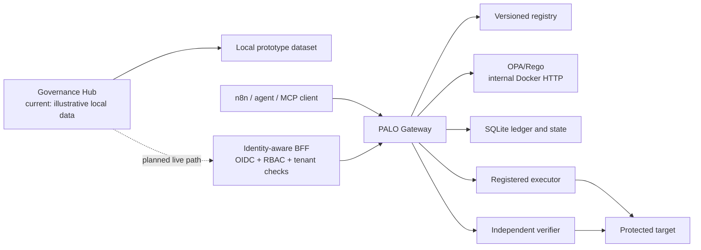

# PALO-AI v2.5 — Technical and Security Assessment

> **Assessment date:** 2026-07-19
>
> **Release status:** full-cycle developer preview
>
> **Permitted use:** interoperability evaluation with synthetic or isolated data and mock or reversible tools

## Executive verdict

PALO-AI v2.5 is a coherent, tested reference implementation of full-cycle agentic assurance. It now distinguishes an action that policy permits from an action whose intended effect has been verified against authoritative post-state. The repository includes versioned contracts, default-deny policy evaluation, exact-claim approval, one-time execution capabilities, signed receipts and outcome attestations, incident holds, recovery tests, an n8n package preview and an implemented Governance Hub user-interface prototype.

It is **not** yet a production authorization service or independently assessed security boundary. The current deployment uses shared bearer tokens, environment-held HMAC keys, SQLite, an in-process connector registry and a single-instance recovery model. The Governance Hub currently renders illustrative local data and is not connected directly to the Gateway. Production adoption therefore requires an identity-aware backend-for-frontend, workload identity, principal-level RBAC, managed key custody, durable multi-tenant infrastructure, connector isolation, observability and independent security testing.

## What is implemented

| Capability | Evidence-backed status | Current boundary |
| --- | --- | --- |
| Canonical Action Claim and Effect Contract | Implemented | JSON Schema validation preserves additive fields for contract evolution; only validated fields may influence trust decisions |
| Rego v1 policy and fail-closed behavior | Implemented | Explicit fallback deny plus malformed-input, missing-profile and OPA-outage tests |
| MCP server | Implemented over stdio; remote transport is prototype | Official SDK, authenticated Streamable HTTP, host allowlist and least-privilege tool filtering |
| Registry, replay controls and ledger | Prototype | Transactional SQLite/WAL, nonce, idempotency and sequence controls; not durable multi-region infrastructure |
| Approval state machine | Prototype | Exact claim-digest binding and immutable terminal resolution; enterprise reviewer identity is not implemented |
| Full-cycle governed execution | Prototype | One-time capabilities, registered executor/verifier, signed receipt, outcome verification and incident hold |
| Crash recovery | Prototype | Tested single-instance outbox recovery; not distributed exactly-once execution |
| n8n integration | Prototype | Package 0.2 is unpublished and not n8n-verified; direct alternate credentials can still bypass governance |
| Governance Hub | Implemented interface prototype | Tested React/Vite GUI using illustrative local data; live BFF/OIDC/RBAC integration remains a release gate |
| Collaborative agent teams | Specified | Team-level leases, conflict handling and durable shared-task coordination are not implemented |

The machine-readable source of truth remains [`agentic/capability-matrix.json`](../agentic/capability-matrix.json). A capability is production-ready only when that file explicitly gives it that status.

## Assessed architecture

The public HTTPS edge authenticates the reference Gateway with a coarse bearer token. OPA is reachable only on the private container network in the supplied VPS topology, but the Gateway-to-OPA hop is not mutually authenticated. A production design must add service identity and authenticated policy distribution or bundle attestation; mTLS is required where the chosen trust boundary permits interception or lateral movement.

## Security-review disposition

| Observation | Disposition | Action |
| --- | --- | --- |
| A tracked deployment `.env` could expose secrets | Not reproduced | `.env` is ignored, untracked and has no repository history; setup generates random values and restricts permissions |
| `safeEqual` suggested constant-time comparison | Not a cryptographic comparison | Renamed to `canonicalEqual` to remove misleading security semantics; cryptographic comparisons remain constant-time where required |
| Contract schemas allow unknown fields | Intentional compatibility boundary | Additive data is preserved, but unknown fields are explicitly untrusted and must never drive authorization, identity or execution |
| Rego lacked an obvious top-level default | Defense-in-depth improvement | Added an explicit default-deny decision while retaining the existing malformed-input and missing-profile denial paths |
| Internal OPA uses HTTP | Needs deployment-specific review | Acceptable only inside the documented isolated preview network; production requires authenticated workload and policy channels |
| Browser token exposure | Future integration risk, not present in the prototype | The current Hub has no live Gateway token; the live design must use a same-origin BFF and must never ship shared runtime credentials to the browser |

## Claim discipline

- `allowed` means the current authority and policy checks permitted the exact claim.
- `verified` means a registered verifier observed authoritative post-state satisfying the immutable Effect Contract.
- `mismatch` or `inconclusive` creates review work; neither state may be presented as success.
- A hash chain and HMAC can expose modification within the stated key boundary. They do not provide immutability against a privileged host operator or public-key non-repudiation.
- Idempotency reduces duplicate effects only when the protected connector honors it. The preview does not claim universal exactly-once execution.
- A visible n8n node is not an unavoidable control boundary when the workflow retains a direct route to the protected credential or tool.

## Production-readiness gaps

1. Replace shared bearer tokens with workload identity, OIDC/OAuth and scoped principal/tenant RBAC.
2. Put the Governance Hub behind a same-origin BFF; add authenticated executive, reviewer and operator sessions with server-side authorization.
3. Move secrets and signing keys to KMS/HSM-backed custody with rotation, revocation and separation of duties.
4. Replace SQLite and in-process recovery with PostgreSQL, a durable queue/outbox, multi-replica coordination, backup and tested restore.
5. Isolate and attest connector workloads; enforce egress policy and prevent alternate privileged execution paths.
6. Authenticate the policy-distribution channel and verify policy/bundle provenance; use mTLS where the threat model requires it.
7. Add tenant-isolation, abuse/rate-limit, audit-retention and disaster-recovery tests.
8. Validate package 0.2 on fresh supported n8n canvases and real reversible connectors before npm or n8n template submission.
9. Commission external threat modelling, application/API penetration testing, cryptographic design review and container/supply-chain assessment.

## Recommended release position

Publish v2.5 as a **full-cycle developer preview** and invite design partners to test one synthetic or reversible action end to end. Do not market it as production-ready, certified, tamper-proof, biometric, exactly-once or impossible to bypass. Promotion should demonstrate the observable difference between direct execution and governed execution, then expose the evidence, latency and reviewer-effort measurements needed to reduce adoption friction.

## Verification references

- [Full-Cycle Assurance Guide](palo-ai-full-cycle-assurance.md)
- [Governance Integration Guide](palo-ai-governance-integration-guide.md)
- [VPS Deployment Guide](palo-ai-vps-deployment.md)
- [Governance Hub Status](palo-ai-governance-hub-status.md)
- [Security Policy](../SECURITY.md)
- [Capability Matrix](../agentic/capability-matrix.json)
